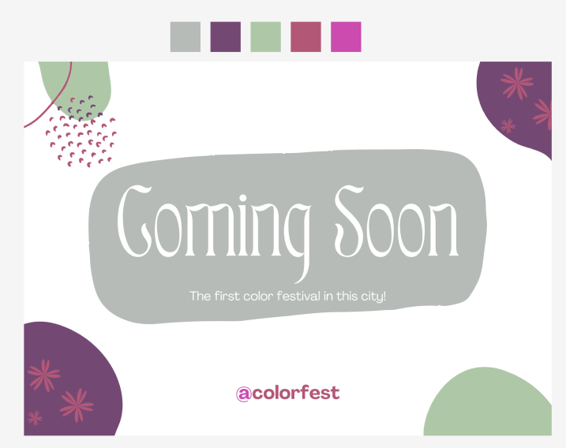

#CTF #COMPFEST16 #COMPFESTHackingClass #Forensic #WriteUp 

>**Flag:** `COMPFEST16{tru3c0l0rsins1d3y0uu}`
### Write Up:
Kita diberi file berupa foto, Hint terdapat pada deskripsi dan grup discord COMPFEST16. Kita cari 5 warna terbanyak dalam foto tersebut.


```
B6BBB7 734974 AEC8A7 B35777 CB4BAE
```

Setelah di identifikasi, 5 warna terbanyak sudah kita dapatkan. Hex code warna tersebut diurutkan dari yang terbesar lalu kita masukkan ke Cyber Chef.

Karena soal ini adalah 'dukun', dalam discord COMPFEST16 memberikan hint jika resep racikan adalah `from Hex to Base64`.
```
tru3c0l0rsins1d3y0uu
```
Flag telah ditemukan, Tambahkan format flag `COMPFEST16{}` dan masukkan flag ke dalam kurung.