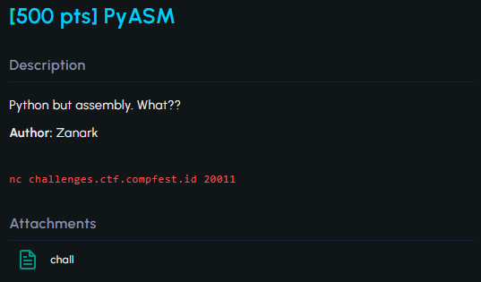
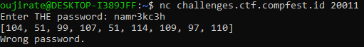
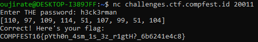

#COMPFEST16 #ReverseEngineering #wu

>**Flag:** `COMPFEST16{pYth0n_4sm_1s_3z_r1gtH?_6b6241e4c8}`


### Write Up:
Kita diberi file `chall` yang berisi Assembly Python (Source code berada di paling bawah).
Apabila kita tulis Assembly tersebut pada bahasa python lebih kurang menjadi seperti berikut:
```python
pw = input('Enter THE Password: ')
if pw.isalnum():
    if len(pw) > 9:
        print('Password is too long')
        exit()
    if len(pw) < 9:
        print('Password is too short!')
        exit()
  
    x = [0,0,0,0,0,0,0,0,0]
    for i in range(9):
        x[i] = ord(pw[i])
        
    if (
        x[7] + 69 == 120 and
        x[3] ^ 1337 == 1355 and
        x[0] // 22 == 5 and
        x[4] - 16 == 35 and
        x[8] << 3 == 832 and
        x[1] ** 2 == 9409 and
        x[6] * 7 == 693 and
        ~x[2] == -110 and
        x[5] == 107
    ):
        print("Correct! Here's your flag: ")
        with open('flag.txt', 'r') as file:
            file.read()
    else:
        print("Wrong Password")
else:
    print('Password format is not valid!')
    exit()
```

Untuk mendapatkan flag, kita harus menetapkan nilai x yang sesuai. Jadi, kita bisa lakukan reverse pada code diatas.

| Opearation            | Reversed            | Penjelasan                                                                                                                                                                      |
| --------------------- | ------------------- | ------------------------------------------------------------------------------------------------------------------------------------------------------------------------------- |
| `x[0] // 22 == 5`     | `x = 5 * 22`        | `//` *(Floor Division)* merupakan pembagian pembulatan ke bawah, jadi kebalikannya adalah `*` (perkalian)                                                                       |
| `x[1] ** 2 == 9409`   | `x = 9409 ** (0.5)` | Kebalikan dari pangkat adalah akar, Dalam python kita bisa melakukan operasi akar dengan memangkatkan bilangan dengan 1/pangkat                                                 |
| `~x[2] == -110`       | `x = -110`          | Sama seperti operasi minus, disini kita pindahkan not ke sebrang ruas                                                                                                           |
| `x[3] ^ 1337 == 1355` | `x = 1355 ^ 1337`   | Untuk mencari nilai XOR, kita cukup melakukan XOR dengan bilangan yang sudah ada untuk menemukan kembali nilai x                                                                |
| `x[4] - 16 == 35`     | `x = 35 + 16`       | Kebalikan dari `-` adalah `+`                                                                                                                                                   |
| `x[5] == 107`         | `x = 107`           | Tetap                                                                                                                                                                           |
| `x[6] * 7 == 693`     | `x = 693 / 7`       | Kebalikan dari perkalian adalah pembagian                                                                                                                                       |
| `x[7] + 69 == 120`    | `x = 120 - 69`      | Kebalikan dari operasi `+` adalah `-`                                                                                                                                           |
| `x[8] << 3 == 832`    | `x = 832 >> 3`      | Operasi `>>` merupakan pergeseran bilangan biner sebanyak angka yang diinginkan. Jadi untuk mengembalikannya adalah dengan menggeser ke arah sebaliknya dengan angka yang sama. |
Selanjutnya kita akan reverse fungsi `ord()`.

`ord()` dalam python adalah untuk mengembalikan nilai Unicode dari sebuah karakter. Kebalikannya adalah `chr()` yang merupakan fungsi untuk mengembalikan karakter dari sebuah Unicode.
```python
rev_op = {
    0 : 22 * 5 , 1 : 9409 ** 0.5 , 2 : ~-110 , 3 : 1355 ^ 1337 , 4 : 35 + 16 ,
    5 : 107 , 6 : 693 / 7 , 7 : 120 - 69 , 8 : 832 >> 3 
    }

pw = ""
for i in range(9):
    rev_pw = chr(int(rev_op[i]))
    pw += rev_pw
   
print(pw)
```
**Output:**
```
namr3kc3h
```

Kita coba untuk masukan ke dalam `nc` yang telah disediakan.



Ternyata passwordnya masih salah, disitu juga ditampilkan nilai Unicode dari setiap karakter kita. Apabila kita perhatikan, nilai Unicode yang kita pasang terurut terbalik dengan output pada reverse yang telah kita buat. Tinggal kita buat output dari string secara reversed dengan menambahkan `print(pw[::-1])`.

```python
rev_op = {
    0 : 22 * 5 , 1 : 9409 ** 0.5 , 2 : ~-110 , 3 : 1355 ^ 1337 , 4 : 35 + 16 ,
    5 : 107 , 6 : 693 / 7 , 7 : 120 - 69 , 8 : 832 >> 3 
    }

pw = ""
for i in range(9):
    rev_pw = chr(int(rev_op[i]))
    pw += rev_pw
   
print(pw[::-1])
```
**Output:**
```
h3ck3rman
```

Coba masukkan lagi ke dalam input dan flag berhasil ditemukan.

