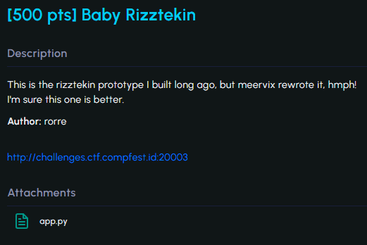
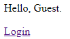
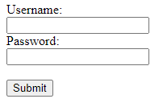
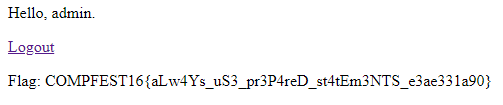

#CTF #COMPFEST16 #COMPFESTHackingClass #WriteUp #WebExploitation 

>**Flag:** `COMPFEST16{aLw4Ys_uS3_pr3P4reD_st4tEm3NTS_e3ae331a90}`


### Write Up:
Kita diberi website login sederhana


(Login Button Clicked) 


Kita analisis source code `app.py` yang telah diberikan pada soal. Dalam code terdapat informasi diantaranya:
1. Kita mendapatkan informasi user dan passwordnya
```python
    db.execute(
        """INSERT OR IGNORE INTO users(id, username, password, is_admin) VALUES
            (1, 'rorre', 'meow', 0),
            (2, 'meervix', 'toksik', 0);
            """
    )
    db.commit()
```

2. Kunci untuk mendapatkan flag adalah dengan `is_admin = 1`. `row[0][0]` adalah `username`, `row[0][1]` adalah `is_admin`
```python
    bottom = "<a href='/login'>Login</a>"
    if user != "Guest":
        row = query("SELECT username, is_admin FROM users WHERE id = ?", [user])[0]
        if row:
            user = row[0][0]
            bottom = "<a href='/logout'>Logout</a>"
            if row[0][1] == 1:
                bottom += f"<p>Flag: {FLAG}</p>"
        else:
            user = "Guest"
```

3. Input langsung ditulis di query yang menyebabkan adanya kerentanan terhadap SQL injection
```python
row = query(f"SELECT id FROM users WHERE username = '{username}' AND password = '{password}'")[0]
```

Kesimpulannya, agar dapat login dengan mendapatkan flag kita bukan hanya perlu bypass login tetapi juga mengatur kondisi jika `is_admin = 1`. Kita bisa isi username dan password sebagai berikut
- Username = `rorre`
- Password = `' or is_admin = 1--`


