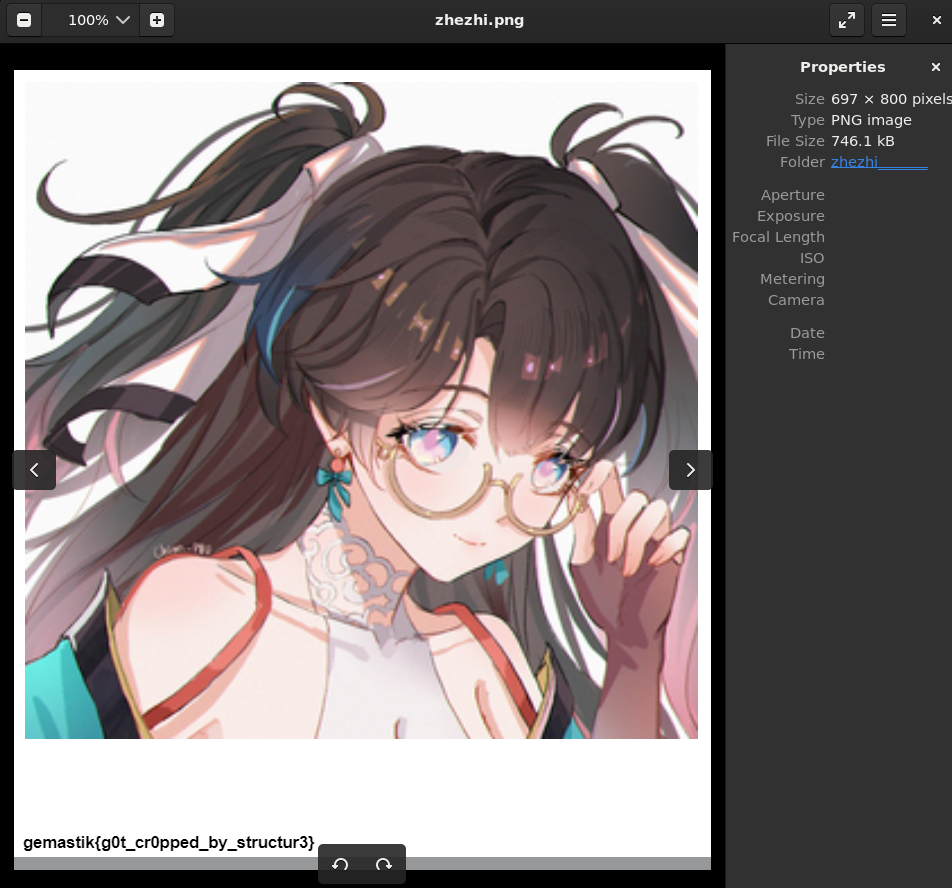

# Baby Structured

my friend sent me a picture, but she say its got 'cropped'. can you recover it?


#Forensic #wu #png 
___
Diberi file png dalam
```
┌──(kali㉿oujisan)-[/mnt/c/Users/Ouji/Downloads/zhezhi_______]
└─$ ls
zhezhi_______

┌──(kali㉿oujisan)-[/mnt/c/Users/Ouji/Downloads/zhezhi_______]
└─$ file zhezhi_______
zhezhi_______: PNG image data, 697 x 531, 8-bit/color RGBA, non-interlaced
```

Pada deskripsi soal, terlihat fotonya kena crop, salah satu cara recover adalah dengan mengubah hex dari file tersebut.

Berikut panduan mengenai [Struktur PNG](https://medium.com/@0xwan/png-structure-for-beginner-8363ce2a9f73).

Untuk mengubah ukuran file kita harus mengubah hex ukuran width x height pada IHDR Chunk.
```
┌──(kali㉿oujisan)-[/mnt/c/Users/Ouji/Downloads/zhezhi_______]
└─$ xxd zhezhi_______ | head
00000000: 8950 4e47 0d0a 1a0a 0000 000d 4948 4452  .PNG........IHDR
00000010: 0000 02b9 0000 0213 0806 0000 00a5 ae0f  ................
00000020: 8800 0000 0173 5247 4200 aece 1ce9 0000  .....sRGB.......
00000030: 0004 6741 4d41 0000 b18f 0bfc 6105 0000  ..gAMA......a...
00000040: 0009 7048 5973 0000 0ec3 0000 0ec3 01c7  ..pHYs..........
00000050: 6fa8 6400 00ff a549 4441 5478 5eec fd67  o.d....IDATx^..g
00000060: 9b23 c995 250c de08 6820 105a 4746 caca  .#..%...h .ZGF..
00000070: aaac 2c5d 24ab 4816 d93d 9c99 9e9d de99  ..,]$.H..=......
00000080: 779f fdb4 fb77 f61f edee bbdb 3bd3 336f  w....w......;.3o
00000090: 77b3 a945 e9ca aacc 4a2d 2243 6b04 3410  w..E....J-"Ck.4.
```

8 Bytes pertama adalah file signature PNG
```
89 50 4E 47 0D 0A 1A 0A
```

4 Bytes selanjutnya adalah jumlah size chunk
```
00 00 00 0D
```

4 Bytes setelah size chunk adalah tipe chunk, yaitu IHDR
```
49 48 44 52
```

dan setelahnya adalah 13 bytes data yang berisi ukuran, gambar, dll dari gambar.
Jadi, 4 Bytes pertama pada data chunk ini adalah width (Line kedua paling kiri) dan 4 bytes setelahnya adalah height.

Jika di ubah hexadecimal ke decimal dari 8 bytes pertama line kedua `00 00 02 B9` `00 00 02 13`
menjadi `697` `531`. Hal ini match dengan ukuran dari gambar. Karena dari gambar seperti terpotong bagian bawah, maka kita akang mengubah height nya saja.

Ubah hex `00 00 02 13` menjadi sekitar 800 atau 900. Kita ubah jadi 800 saja, `320` atau `00 00 03 20`.

Ketika dibuka ternyata ada tu flagnya dipojok kiri.

Namun, ketika dibuka pada `eog` terdapat error CRC Error. Cara fixnya adalah cek dulu pada `pngcheck`.
```
┌──(kali㉿oujisan)-[/mnt/c/Users/Ouji/Downloads/zhezhi_______]
└─$ pngcheck -v zhezhi.png
zlib warning:  different version (expected 1.2.13, using 1.3.1)

File: zhezhi.png (746120 bytes)
  chunk IHDR at offset 0x0000c, length 13
    697 x 800 image, 32-bit RGB+alpha, non-interlaced
  CRC error in chunk IHDR (computed 27407a8b, expected a5ae0f88)
ERRORS DETECTED in zhezhi.png
```

Ok, kita ubah CRC pada chunk IHDR dari `A5 AE 0F 88` menjadi `27 40 7A 8B`

Tampilkan lagi gambar

