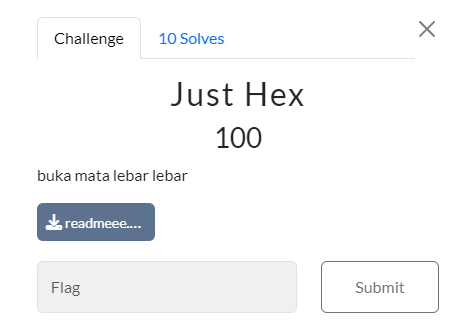
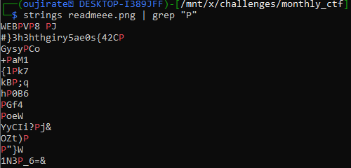

#CTF #MonthlyCTF24 #Forensic #ImageForensic #WriteUp 

>**Flag:** `PC24{s0ea5yrighth3h3}`


### Write Up:
Setelah mengecek `exiftool`, tidak ada data atau informasi yang diperlukan.

Maka, langkah selanjutnya adalah mengecek string dari image tersebut dengan langsung mencari format flag.
```
strings readmeee.png | grep "PC24"
```

Karena tidak ada, kita coba dengan beberapa kemungkinan potongan format flag.


Disini terlihat seperti ada flag yang terbalik, kita ambil string tersebut dan lakukan reverse.
```
echo "}3h3hthgiry5ae0s{42CP" | rev
```

Flag has been found
```
PC24{s0ea5yrighth3h3}
```