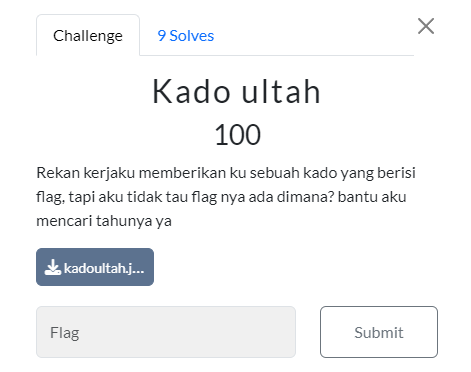
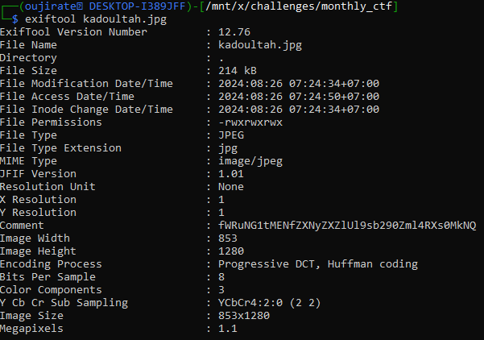
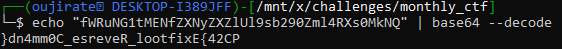

#CTF #MonthlyCTF24 #WriteUp #Forensic #ImageForensic

>**Flag:** `PC24{Exiftool_Reverse_C0mm4nd}`
### Write Up:

karena kita diberi file photo, kita cek metadata dari photo tersebut.


Variabel comment pada photo ini terlihat seperti base64. Kita coba decode string tersebut.
```
echo "fWRuNG1tMENfZXNyZXZlUl9sb290Zml4RXs0MkNQ" | base64 --decode
```


 Flag terlihat terbalik, gunakan `rev` untuk membalik string tersebut.
```
echo "fWRuNG1tMENfZXNyZXZlUl9sb290Zml4RXs0MkNQ" | base64 --decode | rev
```


