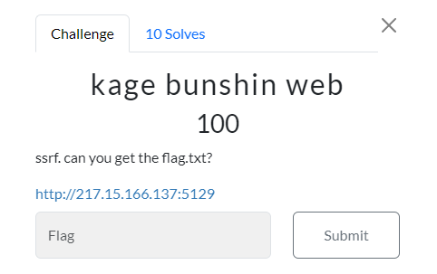
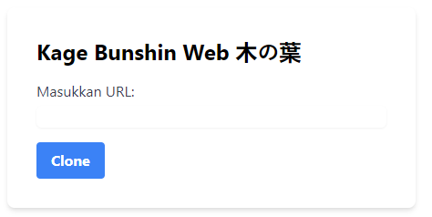
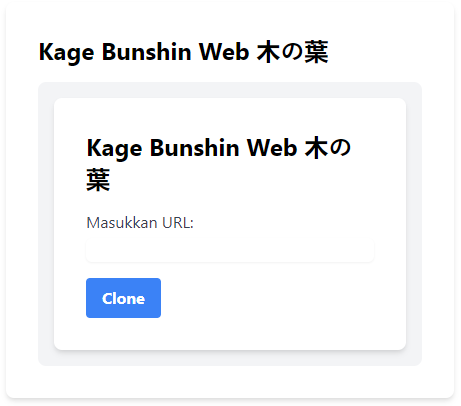

#CTF #MonthlyCTF24 #WriteUp #WebExploitation #SSRF

>**Flag:** `P2CTF{SSRF_Broo}`
### Soal:

### Write Up:
Hint dalam soal yaitu, SSRF atau [[-Server Side Request Forgery (SSRF)]]. gunakan [payload](https://github.com/swisskyrepo/PayloadsAllTheThings/tree/master/Server%20Side%20Request%20Forgery) untuk mempermudah.

coba gunakan `http://127.0.0.1:80` atau `http://localhost:80`.

Maka web akan terduplikasidan apabila mencoba memasukkan hal yang sama maka tidak terjadi apa-apa. Coba masukkan ``http://127.0.0.1:80/index.php`` maka akan muncul web yang sama.

Coba dengan `http://127.0.0.1:80/flag.txt` dan **FLAG HAS BEEN FOUND!!**
