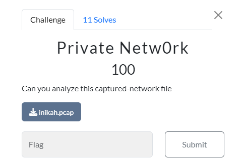
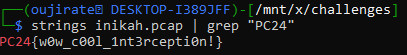

#CTF #MonthlyCTF24 #Forensic #Strings #WriteUp #pcap 

>**Flag:** `PC24{w0w_c00l_1nt3rcepti0n!}`


### Write Up:
karena diberi file `.pcap`, hal pertama yang saya coba adalah mencari strings dengan format flag.
```
strings inikah.pcap | grep "PC24"
```

ternyata kita langsung bisa menemukan flag

