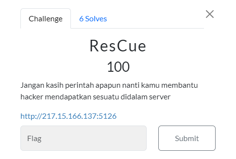
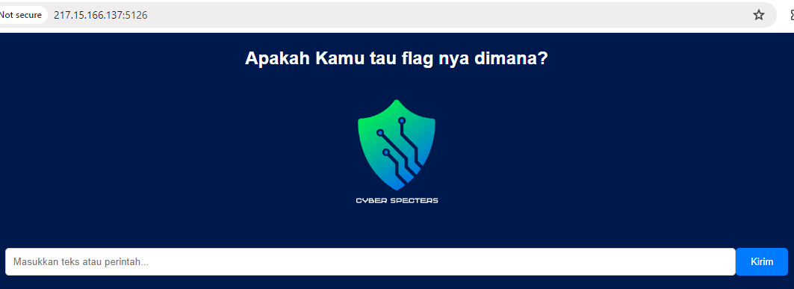
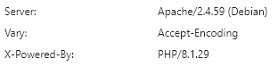
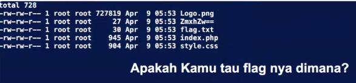
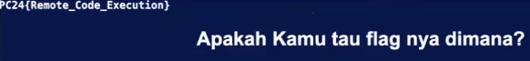

#CTF #WebExploitation #RCE #FileInclusion #WriteUp #MonthlyCTF24 

>**Flag:** `PC24{Remote_Control_Execution}`
### Soal:

### Write Up:

Dalam soal terdapat hint kata **perintah** yang kemungkinan adalah [[-Remote Command Execution (RCE)]] yang memungkinkan kita memberikan perintah.

Pertama, kita analisis web terlebih dahulu menggunakan `inspect`

dari informasi ini kita bisa mengetahui jika web menggunakan bahasa PHP, maka kita akan gunakan command php.
ketika kita mencoba `echo "wafd"` maka pada pojok web akan memunculkan teks "wafd".
Dari sini kita mencoba untuk menampilkan isi directory.
```
<?php system("ls -l");?>
```


kita coba untuk menampilkan flag.txt
```
<?php system("cat flag.txt");?>
```
dan ternyata flag tersebut adalah flag palsu, dalam file diatas terdapat file yang di namanya dienkripsi base64. Kita coba untuk menampilkan dengan command yang sama.
```
<?php system("cat ZmxhZw==");?>
```



**FLAG HAS BEEN FOUND!!**