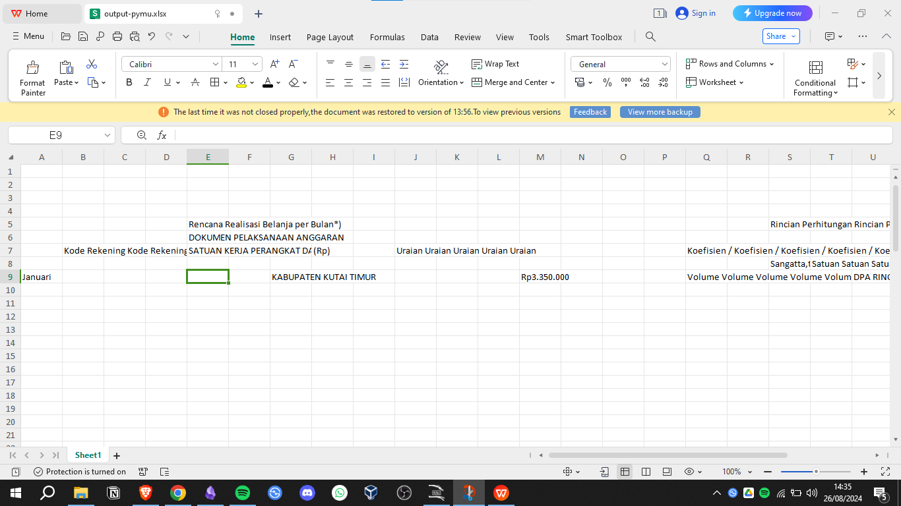

#CTF #MonthlyCTF24 #Forensic #WriteUp #john

> **Flag:** `PC24{3xc3l_l33t_h4cks}`
> 

### Write Up:
Lakukan brute force untuk menemukan password pada file. 
Extract hash file menuju ke `hash.txt`
```
office2john output-pymu.xlsx > hash.txt
```

Lakukan brute force menggunakan wordlist bawaan dari john
```
john hash.txt
```


Setelah menunggu cukup lama password berhasil ditemukan.

Buka `output-pymu.xlsx` menggunakan Excel atau software lainnya dan masukkan password `active`.


Ketika dicari menggunakan `CTRL + F` dengan keyword `PC24`.

 Walaupun teks dari flag diwarnai putih, kita tetap bisa mencari dan melihatnya.
 Flag telah ditemukan.