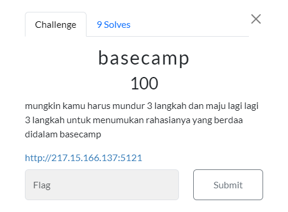
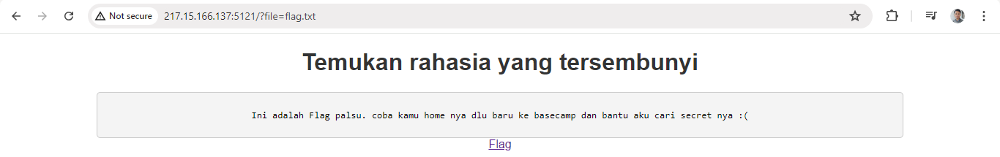
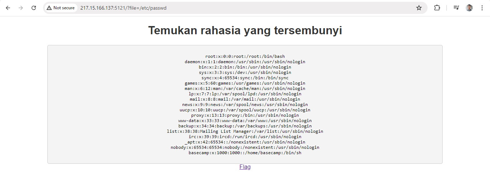
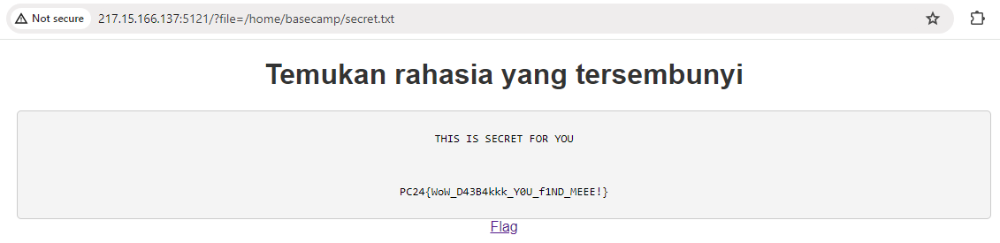

#CTF #MonthlyCTF24 #WebExploitation #FileInclusion #WriteUp

>**Flag:** `PC24{WoW_D43B4kkk_Y0U_f1ND_MEEE!}`
### Soal:

### Write Up:

dalam web terdapat link `Flag` yang apabila kita tekan ternyata zonk

disini kita bisa melihat kerentanan dari website diatas pada `?file=flag.txt`. Jika kita ubah acak selain `flag.txt` maka akan muncul `file not found`. Dari sini kita bisa mengasumsikan jika `file=` menampilkan isi dari file yang ada. Kerentanan ini disebut Local File Inclusion dimana kita bisa mengakses file yang tidak seharusnya bisa di akses.

Pertama, kita ganti `flag.txt` menjadi `/etc/passwd` untuk mengetahui nama user yang terdaftar

kita coba mengakses `/home/basecamp` dan menebak nama file flagnya. Setelah mencoba `flag.txt` tidak ada dalam directory tersebut. Lalu, kita coba `secret.txt` dan **FLAG HAS BEEN FOUND!**
 
 