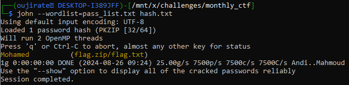
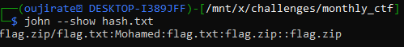
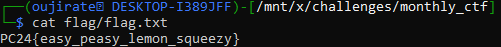

#CTF #Forensic #WriteUp #MonthlyCTF24 #john

>**Flag:** `PC24{easy_peasy_lemon_squeezy}`

![[guesmyname00.png]]

### Write Up:
Kita akan menggunakan tool `john` untuk brute force password dari `flag.zip` menggunakan wordlist `pass_list.txt`.

Pertama, kita extract hash dari `flag.zip`
```
zip2john flag.zip > hash.txt
```

Selanjutnya kita lakukan brute force menggunakan wordlist `pass_list.txt`.
```sh
john --wordlist=pass_list.txt hash.txt
```


Passwordnya adalah `Mohamed`. lakukan `john --show hash.txt` untuk melihat lebih detail.
```
john --show hash.txt
```


 Dalam zip terdapat file `flag.txt` yang kemungkinan besar berisi flag.

Lakukan unzip menggunakan password tersebut.
Hasil dari extract akan berada pada folder `flag` agar lebih mudah dilihat.
```
unzip -P "Mohamed" -d flag flag.zip
```

Langsung kita tampilkan `flag.txt`
```
cat flag/flag.txt
```

Flag ditemukan

