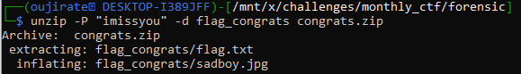

#CTF #MonthlyCTF24 #Forensic #john #WriteUp 

>**Flag:** `PC24{paten_kali_kau_bang}`


### Write Up:
File `congrats.zip` dilindungi dengan password serta dalam `hint.txt` kita tidak menemukan informasi yang berguna. 

Jadi kita akan brute force zip menggunakan `john`.

Extract hash dari `congrats.zip` ke dalam `congrats_hash.txt`
```
zip2john congrats.zip > congrats_hash.txt
```


Brute Force password menggunakan wordlist bawaan dari `john`
```
john congrats_hash.txt
```

Ditemukan password dari file zip tersebut adalah `imissyou`.

Extract file zip menggunakan `unzip` dengan password diatas (`-P`) dan dalam folder baru (`-d`) untuk memudahkan melihat hasil unzip.


Cek `flag.txt`

```
cat flag.txt
```

Ternyata ini adalah flag palsu. Kita cek `sadboy.jpg`


Gunakan `display` untuk menampilkan gambar menggunakan `ImageMagick`.
```
display sadboy.jpg
```


Flag telah ditemukan