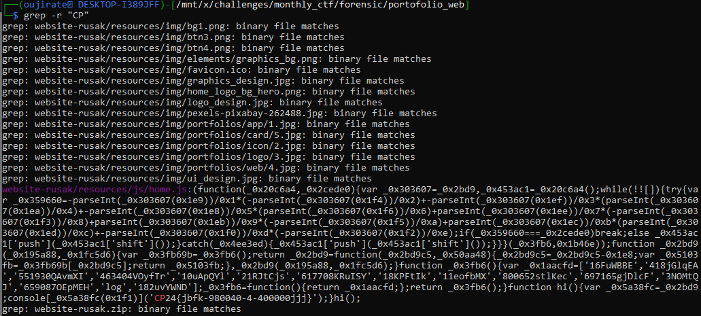
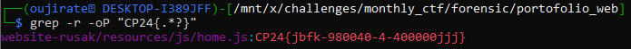

#CTF #MonthlyCTF24 #Forensic #WriteUp 

> **Flag**: `PC24{jbfk-980040-4-400000jjj}`

### Write Up:
Extract file `website-rusak.zip`
```
unzip website-rusak.zip
```

apabila kita cek menggunakan `tree` , dalam folder `website rusak` terdapat 14 direktori dan 70 file di dalamnya. Untuk mempermudah pencarian flag, kita langsung mencari format flag `PC24`. 

Karena setelah mencari `PC` tidak menunjukkan hasil, kita coba kombinasi lain seperti `CP` dan lain-lain.

```
grep -r "CP"
```


Disini flag sudah ditemukan dalam `website-rusak/resources/js/home.js`.

Agar langsung menampilkan flag saja, kita bisa menggunakan command berikut:
```bash
grep -r -oP "CP24{.*?}"
```


Keterangan:
`-r` : digunakan untuk mencari pada seluruh directory tertentu.
`-o`: Hanya mencetak bagian dari teks yang cocok dengan pola.
`-P`: Mengaktifkan Perl Compatible Regular Expressions (PCRE) untuk mendukung pola regex yang lebih kompleks.
`".*?"`: Mencari semua karakter di antara tanda kutip ganda, menggunakan pendekatan non-greedy (`*?`).