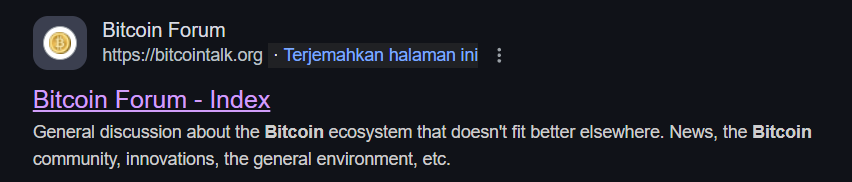
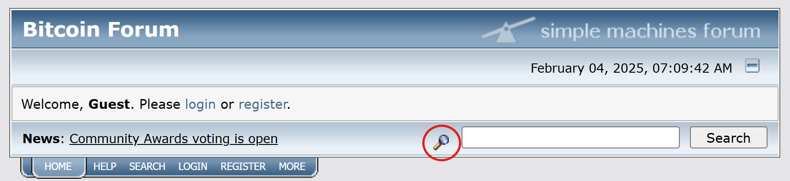
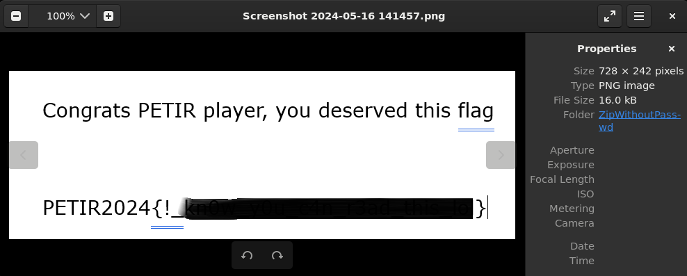
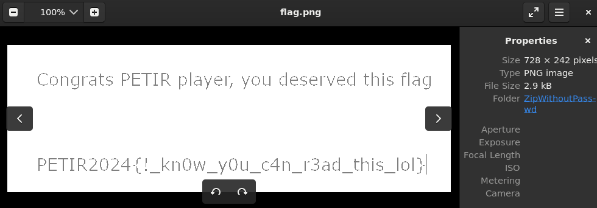

# Blockchain Madness
Apparently aseng could predict the inflow of Bitcoin & Altcoins from Daily news on the market.

He once discovered where was he get all the news and gossips so he saved the front page in a local file with a screenshot containing a secret flag picture.

He compressed all of them with a very unique password, but sadly **he forgot the password once again** ~ 💀.

Flag is in the screenshot picture of the compressed archive.

Notes: You cannot brute force this file since the password is **very long**

#DigitalForensic #Osint #Misc #zip #pembinaan-gelatik-laos-25
___
Diberi file `.zip` dalam keadaan terkunci. Tujuan kita adalah membuka zip dan mendapatkan flag yang terdapat pada file png.
```
┌──(kali㉿oujisan)-[~/chall]
└─$ ls
asengchallenge.zip
```

Intip terlebih dahulu isi dari `asengchallenge.zip`
```
unzip -l asengchallenge.zip
```

```┌──(kali㉿oujisan)-[~/chall]
└─$ unzip -l asengchallenge.zip
Archive:  asengchallenge.zip
  Length      Date    Time    Name
---------  ---------- -----   ----
    93954  2024-05-16 14:28   Bitcoin Forum - Index.html
        0  2024-05-16 14:28   Bitcoin Forum - Index_files/
      148  2024-05-16 14:28   Bitcoin Forum - Index_files/collapse.gif
      216  2024-05-16 14:28   Bitcoin Forum - Index_files/filter.gif
      670  2024-05-16 14:28   Bitcoin Forum - Index_files/info.gif
     1154  2024-05-16 14:28   Bitcoin Forum - Index_files/mobile.css
      473  2024-05-16 14:28   Bitcoin Forum - Index_files/off.gif
      392  2024-05-16 14:28   Bitcoin Forum - Index_files/powered-mysql.gif
      415  2024-05-16 14:28   Bitcoin Forum - Index_files/powered-php.gif
       60  2024-05-16 14:28   Bitcoin Forum - Index_files/print.css
    13762  2024-05-16 14:28   Bitcoin Forum - Index_files/script.js.download
     1115  2024-05-16 14:28   Bitcoin Forum - Index_files/smflogo.gif
    13857  2024-05-16 14:28   Bitcoin Forum - Index_files/style.css
      141  2024-05-16 14:28   Bitcoin Forum - Index_files/upshrink.gif
      420  2024-05-16 14:28   Bitcoin Forum - Index_files/valid-css.gif
      471  2024-05-16 14:28   Bitcoin Forum - Index_files/valid-xhtml10.gif
      270  2024-05-16 14:28   Bitcoin Forum - Index_files/xx.gif
    15970  2024-05-16 14:39   Screenshot 2024-05-16 141457.png
---------                     -------
   143488                     18 files
```

Sesuai deskripsi diatas, aseng menyimpan web atau *web archiving* bitcoin forum ke dalam zip lalu flag berada pada file `Screenshot 2024-05-16 141457.png`.

Terdapat hint pada soal bahwa "Password sangat unik dan sangat panjang sehingga tidak bisa dilakukan bruteforce". Jadi, sementara ini abaikan tool `john` atau `fcrackzip`.

Jika mengecek menggunakan `zipinfo`, terdapat informasi bahwa  zip tersebut menggunakan PKWARE traditional encryption (ZipCrypto). Hal ini memungkinkan kita untuk melakukan Known Plaintext Attack (KPI).
```
zipinfo -v asengchallenge.zip
```

```
  ...
  The central-directory extra field contains:
  - A subfield with ID 0x000a (PKWARE Win32) and 32 data bytes.  The first
    20 are:   00 00 00 00 01 00 18 00 a9 26 25 3a 64 a7 da 01 00 00 00 00.
  ...
```

Perlu diingat aseng download web archive dari market atau forum bitcoin, mari kita coba cari website bitcoin forum di google. Hasilnya muncul teratas adalah `bitcointalk.org`.



Untuk apa kita mencari web tempat aseng mendownload `web archive`? 
Karena kita akan melakukan **Known Plaintext Attack (KPI)** pada ZIP. Secara singkatnya, melakukan serangan pada zip menggunakan file asli atau file yang sama dengan yang berada di zip. Gunakan `bkcrack` atau `pkcrack` untuk melakukan serangan.

Sebelum itu, kita perlu plaintext atau file asli sebagai sample. Download salah satu file yang ada pada zip dan pada website `bitcointalk.org`. Sebagai sample akan menggunakan `filter.gif`


Atau download halaman depan Bitcoin Forum jika file yang di download tidak dapat menemukan key.
```
┌──(kali㉿oujisan)-[/mnt/d/PembinaanCTFGelatik25/DigitalForensic/BlockchainMadness/bitcoin forum]
└─$ tree
.
├── Bitcoin Forum - Index_files
│   ├── collapse.gif
│   ├── filter.gif
│   ├── info.gif
│   ├── mobile.css
│   ├── off.gif
│   ├── powered-mysql.gif
│   ├── powered-php.gif
│   ├── print.css
│   ├── script.js.download
│   ├── smflogo.gif
│   ├── style.css
│   ├── upshrink.gif
│   ├── valid-css.gif
│   ├── valid-xhtml10.gif
│   └── xx.gif
└── Bitcoin Forum - Index.html
```

Lakukan serangan menggunakan plain-file `filter.gif`.
```
bkcrack -C asengchallenge.zip -c "Bitcoin Forum - Index_files/filter.gif" -p filter.gif
```
- `-C` - Chiper Zip (Zip yang terenkripsi)
- `-c` - Chiper file (File dalam zip yang sudah terenkripsi)
- `-p` - plaintext / plain-file (File asli yang tidak terenkripsi)

```
┌──(kali㉿oujisan)-[~/chall]
└─$ ../bkcrack-1.7.1-Linux/bkcrack -C asengchallenge.zip -c "Bitcoin Forum - Index_files/filter.gif" -p filter.gif
bkcrack 1.7.1 - 2024-12-21
[16:19:29] Z reduction using 209 bytes of known plaintext
100.0 % (209 / 209)
[16:19:30] Attack on 37591 Z values at index 6
Keys: ba2b82f6 41525f26 818ca9e6
67.4 % (25325 / 37591)
Found a solution. Stopping.
You may resume the attack with the option: --continue-attack 25325
[16:19:41] Keys
ba2b82f6 41525f26 818ca9e6
```

Ditemukan key `ba2b82f6 41525f26 818ca9e6`.  Selanjutnya untuk membuka zip dengan menghilangkan password.

Untuk mempersingkat, kali ini akan menggunakan nomor 1.  Point  3 akan dicoba setelah menemukan flag.
```
bkcrack -C asengchallenge.zip -k ba2b82f6 41525f26 818ca9e6 -D asengwithoutpasswd.zip
```

```
┌──(kali㉿oujisan)-[~/chall]
└─$ ../bkcrack-1.7.1-Linux/bkcrack -C asengchallenge.zip -k ba2b82f6 41525f26 818ca9e6 -D asengwithoutpasswd.zip
bkcrack 1.7.1 - 2024-12-21
[16:29:42] Writing decrypted archive asengwithoutpasswd.zip
100.0 % (17 / 17)
```
- `-D` - Decrypt

Unzip saja zip yang sudah tidak terenkripsi.
```
unzip asengwithoutpassword.zip
```

```
┌──(kali㉿oujisan)-[~/chall/ZipWithoutPasswd]
└─$ unzip asengwithoutpasswd.zip
Archive:  asengwithoutpasswd.zip
  inflating: Bitcoin Forum - Index.html
   creating: Bitcoin Forum - Index_files/
 extracting: Bitcoin Forum - Index_files/collapse.gif
 extracting: Bitcoin Forum - Index_files/filter.gif
 extracting: Bitcoin Forum - Index_files/info.gif
  inflating: Bitcoin Forum - Index_files/mobile.css
 extracting: Bitcoin Forum - Index_files/off.gif
 extracting: Bitcoin Forum - Index_files/powered-mysql.gif
 extracting: Bitcoin Forum - Index_files/powered-php.gif
  inflating: Bitcoin Forum - Index_files/print.css
  inflating: Bitcoin Forum - Index_files/script.js.download
  inflating: Bitcoin Forum - Index_files/smflogo.gif
  inflating: Bitcoin Forum - Index_files/style.css
 extracting: Bitcoin Forum - Index_files/upshrink.gif
 extracting: Bitcoin Forum - Index_files/valid-css.gif
 extracting: Bitcoin Forum - Index_files/valid-xhtml10.gif
 extracting: Bitcoin Forum - Index_files/xx.gif
  inflating: Screenshot 2024-05-16 141457.png
```

Buka `Screenshot 2024-05-16 141457.png` untuk mendapatkan flag.
```
┌──(kali㉿oujisan)-[~/chall/ZipWithoutPasswd]
└─$ eog Screenshot\ 2024-05-16\ 141457.png
```

Ternyata tulisan flag masih tertutup warna hitam `-_-`


Atur brightness dan contrast menggunakan `imagick` atau tools lain untuk dapat melihat flag.
```
┌──(kali㉿oujisan)-[~/chall/ZipWithoutPasswd]
└─$ convert Screenshot\ 2024-05-16\ 141457.png -brightness-contrast 50x100 flag.png
```


> **`LAOS{!_kn0w_y0u_c4n_r3ad_this_lol}`**
