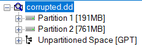
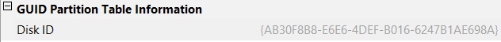

# Corrupted Minds 2
For the rest of Corrupted Minds series, please download and use this file:\

[Link challenge](https://binusianorg-my.sharepoint.com/personal/felix_alexander_binus_ac_id/_layouts/15/guestaccess.aspx?share=EqgEMqMso1VIjqms9NiwmzABR-OEP8LKCCB-YpGCKtn-kg&e=BbQa2w)

How many partitions are in there and what's the disk GUID?

Flag format: LAOS{totalpartition_GUID}

Example: LAOS{5_7ABD-89398-HJDJKJ-SJSK}

#DigitalForensic #imageForensic #ftk-imager #dd #wu
___
Dalam zip terdapat file dengan format `.dd`
```
┌──(kali㉿oujisan)-[/mnt/d/PembinaanCTFGelatik25/DigitalForensic/CorruptedMinds1/Corrupted Minds]
└─$ ls
corrupted.dd
```

Untuk mendapatkan format tabel partisi yang digunakan, pakai `Exterro FTK Imager` untuk analisa lebih lanjut.

Pada gambar, terlihat jelas bahwa jumlah partisi yang ada di dalam image adalah 2. 

Untuk melihat GUID Partisi dapat dilakukan dengan melihat Properties pada `Unpartitioned Space [GPT]`. Pada GUID Partition Table Information terdapat Disk ID yang merupakan GUID disk image.

`{AB30F8B8-E6E6-4DEF-B016-6247B1AE698A}`

> **LAOS{2_AB30F8B8-E6E6-4DEF-B016-6247B1AE698A}**