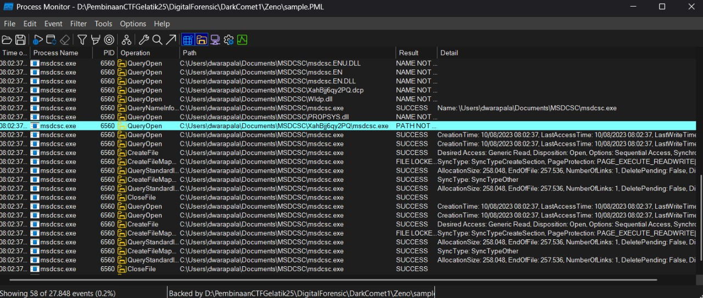

# DarkComet 1
For the rest of DarkComet series challenge, you can download from the following file:

[Link Challenge](https://binusianorg-my.sharepoint.com/personal/felix_alexander_binus_ac_id/_layouts/15/guestaccess.aspx?share=EiA_PvWflgxHq8daNfsiT88B0Pdj28WlAEB-APgyIByK8Q&e=AHS1bJ)

I think a DarkComet malware infects my device!

This malware is pretty sus since it uses a legit services and spawns a malicious child process and creates a folder. What's the name of that folder?

Flag format: LAOS{nameoffolder}
Example: LAOS{DeeskTop}

#DigitalForensic #pml #dark-comet #malware #procmon #wu
___
Terdapat 2 file dengan ekstensi `.dmp` dan `.pml` pada file `Zeno.zip` yang diberikan
```
┌──(kali㉿oujisan)-[/mnt/d/PembinaanCTFGelatik25/DigitalForensic/DarkComet1/Zeno]
└─$ ls
sample.dmp  sample.PML
```

Dalam deskripsi sudah tertera jika perangkat terserang oleh malware dark comet.
>[!NOTE]
>Dark Comet adalah Aplikasi *Remote Access Trojan (RAT)* yang memungkinkan berjalan di latar belakang dan secara diam-diam mengambil informasi tentang sistem, informasi kredensial user, dan aktivitas network[^1].

Biasanya malware Dark Comet menyalin dirinya ke dalam target sistem dalam bentuk `exe` atau executable program. Tujuan soal adalah mencari nama folder yang dihasilkan child proses dari si malware.
> [!NOTE]
> `.dmp` atau *dump file* - menyimpan *snapshot* atau rekaman kondisi sistem atau aplikasi
> 
> `.pml` atau *Performance Monitor Log*  - menyimpan data kinerja sistem.
> 
> Kedua file diatas biasanya digunakan untuk menganalisis masalah dan memperbaikinya.

Analisa file`.pml` menggunakan `ProcMon` dari Microsoft[^3]. Karena process yang ada hanya `msdcsc.exe` saja pada `C:\Users\dwarapala\Documents\MSDCSC\msdcsc.exe`, sekarang tinggal cari sub folder yang dibuat oleh tampilkan hanya "Show File System Activity" saja.

Gunakan filter dengan `path` , `contains`, `C:\Users\dwarapala\Documents\MSDCSC`, `include` untuk memudahkan pencarian.



Hingga didapat sub-folder dengan nama `XahBjj6qy2PQ`.
`C:\Users\dwarapala\Documents\MSDCSC\XahBjj6qy2PQ\msdcsc.exe`

Dapat disimpulkan bahwa folder diatas merupakan sub-folder yang dibuat oleh child-process malware.

> **LAOS{XahBjj6qy2PQ}**

[^1]: https://www.malwarebytes.com/blog/detections/backdoor-darkcomet
[^3]: https://filext.com/file-extension/PML
