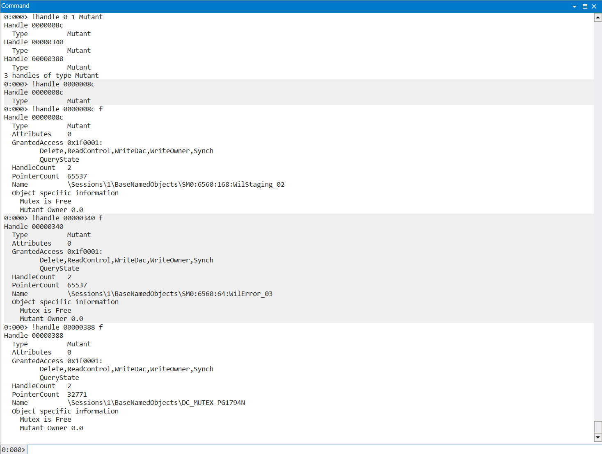

# DarkComet2
For the rest of DarkComet series challenge, you can download from the following file: 

[Link Challenge](https://binusianorg-my.sharepoint.com/personal/felix_alexander_binus_ac_id/_layouts/15/guestaccess.aspx?share=EiA_PvWflgxHq8daNfsiT88B0Pdj28WlAEB-APgyIByK8Q&e=AHS1bJ)

This malware deploys a persistence mechanism and would love to leave a mark in the infected device, usually called a `MUTEX`

Reference: [https://www.sans.org/blog/looking-at-mutex-objects-for-malware-discovery-indicators-of-compromise/](https://www.sans.org/blog/looking-at-mutex-objects-for-malware-discovery-indicators-of-compromise/)

What's the name of the mutex left by this malware ??

Flag format: LAOS{nameofmutex}

Example: LAOS{RANG_TUv_-x828781}

#DigitalForensic #dark-comet #mutex #malware #wu #pembinaan-gelatik-laos-25
___
Terdapat 2 file dengan ekstensi `.dmp` dan `.pml` pada file `Zeno.zip` yang diberikan
```
┌──(kali㉿oujisan)-[/mnt/d/PembinaanCTFGelatik25/DigitalForensic/DarkComet1/Zeno]
└─$ ls
sample.dmp  sample.PML
```

untuk menganalisa file `.dmp` gunakan tool GUI `wingdb` dari Microsoft dan pilih "Open dump file". Pada window command ketik `!analyze -v` untuk memulai menganalisa.

Tujuan soal adalah untuk mencari nama mutex, Mencari seluruh objek mutex dengan bantuan referensi pada deskripsi soal untuk dianalisa.

Berikut command yang pada referensi untuk mencari objek mutex.
```
handle -a | findstr Mutant
```
Sesuaikan command di `windbg` menjadi seperti ini
```
!handle 0 1 Mutant
```

`0` - menampilkan semua handle dalam proses
`1` - menampilkan detail
	`1` - Hak akses
	`2` - Alamat objek
	`3` - Kombinasi 1 dan 2

```
0:000> !handle 0 1 Mutant
Handle 0000008c
  Type         	Mutant
Handle 00000340
  Type         	Mutant
Handle 00000388
  Type         	Mutant
3 handles of type Mutant
```

Terdapat 3 handle dengan tipe mutant, cek satu persatu untuk menemukan petunjuk berikutnya.
```
!handle <nilai handle> f
```

`f` disini untuk menampilkan informasi lebih lengkap



pada `Handle 00000388` nama mutex yaitu `DC_MUTEX-PG1794N`

> **LAOS{DC_MUTEX-PG1794N}**
