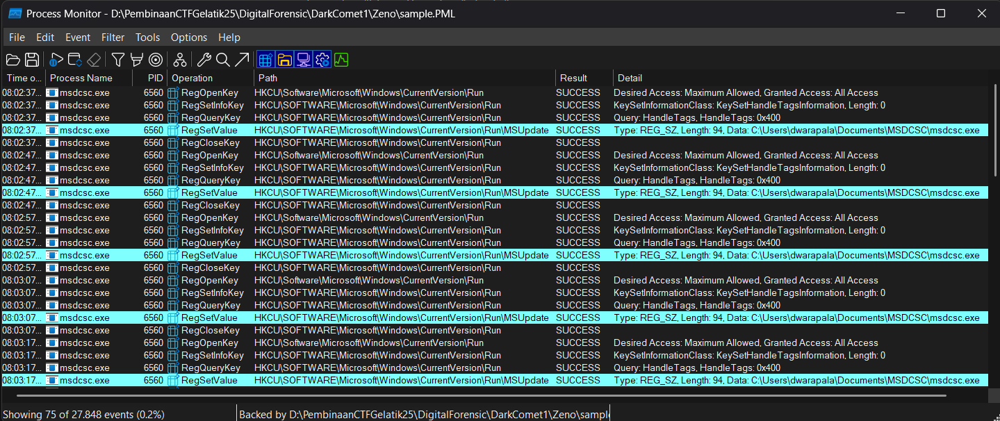

# DarkComet3
For the rest of DarkComet series challenge, you can download from the following file:

[Link Challenge](https://binusianorg-my.sharepoint.com/personal/felix_alexander_binus_ac_id/_layouts/15/guestaccess.aspx?share=EiA_PvWflgxHq8daNfsiT88B0Pdj28WlAEB-APgyIByK8Q&e=AHS1bJ)

Persistence is the key for the malware to be triggered every **run**, what's the name of the registry subkey for this?

Flag format: LAOS{nameofsubkeyregistry}

Example: LAOS{Jajang}

#DigitalForensic #malware #dark-comet #registry #pml #wu #pembinaan-gelatik-laos-25
___
Terdapat 2 file dengan ekstensi `.dmp` dan `.pml` pada file `Zeno.zip` yang diberikan
```
┌──(kali㉿oujisan)-[/mnt/d/PembinaanCTFGelatik25/DigitalForensic/DarkComet1/Zeno]
└─$ ls
sample.dmp  sample.PML
```

Untuk mengetahui registry subkey gunakan `procmon` untuk menganalisa file dan terapkan filter tampilan "Show Registry Activity" saja.

Tujuan dari soal ini adalah menemukan registry subkey yang memungkinkan malware berjalan setiap kali sistem dijalankan.

Setelah melakukan searching, didapatkan bahwa Run and RunOnce Registry Keys biasanya berada pada salah satu pilihan berikut:[^1]
```
- HKEY_LOCAL_MACHINE\Software\Microsoft\Windows\CurrentVersion\Run
- HKEY_LOCAL_MACHINE\Software\Microsoft\Windows\CurrentVersion\RunOnce
- HKEY_CURRENT_USER\Software\Microsoft\Windows\CurrentVersion\Run
- HKEY_CURRENT_USER\Software\Microsoft\Windows\CurrentVersion\RunOnce
```

Gunakan filter lanjutan `path`, `contains` `Software\Microsoft\Windows\CurrentVersion\Run`, `includes` untuk menfokuskan tampilan sesuai dengan petunjuk yang ada dan didapat sebagai berikut:


Didapat pada bagian highlight `HKCU\SOFTWARE\Microsoft\Windows\CurrentVersion\Run\MSUpdate`

`MSUpdate` merupakan kunci yang dicari atau nama subkey registry

> **LAOS{MSUpdate}**

[^1]: https://learn.microsoft.com/en-us/windows/win32/setupapi/run-and-runonce-registry-keys
