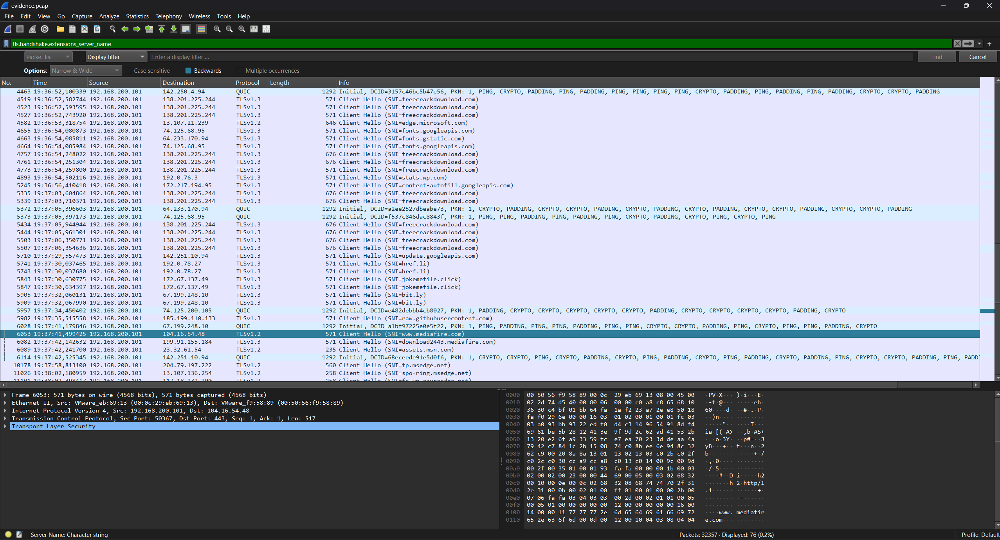

# Malicious Download 1
For the rest of this challenge, you have to download and use this file:

[Link Challenge](https://binusianorg-my.sharepoint.com/personal/felix_alexander_binus_ac_id/_layouts/15/guestaccess.aspx?share=Emz-mcrs9ORBkHpN3uUIKvIBBYuWAfRCVOQkByRoag2dxg&e=gX93CS)

This traffic contains a user that downloads a malicious software. There are two root domains which he visited (directly/indirectly) , if you find that there's a shortener / shortcut link, please ignore it.

Suppose there's a bit.ly that points to nyanyanya.com, then that's the answer!

Flag format: LAOS{domain.tld_domain.tld}

Example: LAOS{jaja.com_hello.id}

#DigitalForensic #wu #pcap 
___
Dalam file zip terdapat 2 file sebagai berikut:
```
┌──(kali㉿oujisan)-[/mnt/d/PembinaanCTFGelatik25/DigitalForensic/MaliciousDownloads1/Malicious Downloads]
└─$ ls
evidence.pcap  evidence.PML
```

Tujuan kali ini adalah untuk mencari domains yang dikunjungi user untuk download software yang mencurigakan. Gunakan `Wireshark` atau `tshark` untuk menganalisa `evidence.pcap`.

Setelah mencari di google dengan keyword "how to know domain user access pcap", terdapat petunjuk dari [security.stackexchange](https://security.stackexchange.com/questions/207862/wireshark-how-to-see-the-domain-of-https-websites-visited) pada point nomor 3 tentang [value of the SNI (Server Name Indication) header of the TLS connection](https://superuser.com/questions/538130/filter-in-wireshark-for-tlss-server-name-indication-field).

Ditemuakan filter sebagi berikut:
```
ssl.handshake.extensions_server_name
```

filter diatas akan menampilkan nama domain yang diminta client melalui ekstensi SNI dalam handshake SSL/TSL.


Pada hasil filter terdapat hal yang menarik perhatian yaitu
```
4773	19:36:54,259800	192.168.200.101	138.201.225.244	TLSv1.3	571	Client Hello (SNI=freecrackdownload.com)
```
Disini client meminta request untuk domain `freecrackdownload.com`, jika mengacu pada software yang mencurigakan maka crack atau pirate masih berhubungan.

Pada deskripsi soal, diberi clue bahwa terdapat `bit.ly` yang mengarah ke suatu domain lagi. Pada traffic diatas setelah proses bit.ly menuju ke arah domain `mediafire.com` yang diperkuat jika client mendownload pada domain tersebut.

```
5909	19:37:32,067990	192.168.200.101	67.199.248.10	TLSv1.3	571	Client Hello (SNI=bit.ly)
6053	19:37:41,499425	192.168.200.101	104.16.54.48	TLSv1.2	571	Client Hello (SNI=www.mediafire.com)
6082	19:37:42,142632	192.168.200.101	199.91.155.184	TLSv1.3	571	Client Hello (SNI=download2443.mediafire.com)
```

Jika menggunakan `tshark`
```
tshark -r evidence.pcap -Y "tls.handshake.extensions_server_name" -T fields -e tls.handshake.extensions_server_name
```
- `-Y` - menerapkan filter
-  `-T` - menampilkan field tertentu
- `-e` - menentukan field yang ingin ditampilkan

```
┌──(kali㉿oujisan)-[/mnt/d/PembinaanCTFGelatik25/DigitalForensic/MaliciousDownloads1/Malicious Downloads]
└─$ tshark -r evidence.pcap -Y "tls.handshake.extensions_server_name" -T fields -e tls.handshake.extensions_server_name
Warning: program compiled against libxml 212 using older 209
www.bing.com
www.bing.com
www.bing.com
www.bing.com
www.bing.com
www.bing.com
optimizationguide-pa.googleapis.com
optimizationguide-pa.googleapis.com
encrypted-tbn0.gstatic.com
encrypted-tbn0.gstatic.com
encrypted-tbn0.gstatic.com
encrypted-tbn0.gstatic.com
encrypted-tbn0.gstatic.com
i.ytimg.com
safebrowsing.googleapis.com
www.youtube.com
www.youtube.com
www.youtube.com
i.ytimg.com
fonts.gstatic.com
fonts.gstatic.com
static.doubleclick.net
googleads.g.doubleclick.net
jnn-pa.googleapis.com
jnn-pa.googleapis.com
googleads.g.doubleclick.net
www.gstatic.com
www.gstatic.com
freecrackdownload.com
freecrackdownload.com
freecrackdownload.com
edge.microsoft.com
fonts.googleapis.com
fonts.gstatic.com
fonts.googleapis.com
freecrackdownload.com
freecrackdownload.com
freecrackdownload.com
stats.wp.com
content-autofill.googleapis.com
freecrackdownload.com
freecrackdownload.com
fonts.gstatic.com
fonts.googleapis.com
freecrackdownload.com
freecrackdownload.com
freecrackdownload.com
freecrackdownload.com
update.googleapis.com
href.li
href.li
jokemefile.click
jokemefile.click
bit.ly
bit.ly
www.google.com
raw.githubusercontent.com
bit.ly
www.mediafire.com
download2443.mediafire.com
assets.msn.com
update.googleapis.com
fp.msedge.net
spo-ring.msedge.net
fp-vp.azureedge.net
k-ring.msedge.net
c885c65bcc2eada6e6590fe8fa37d698.clo.footprintdns.com
fp-afd.azurefd.us
o-ring.msedge.net
safebrowsing.googleapis.com
displaycatalog.mp.microsoft.com
v10.events.data.microsoft.com
fe3cr.delivery.mp.microsoft.com
v10.events.data.microsoft.com
settings-win.data.microsoft.com
settings-win.data.microsoft.com
```

> **LAOS{freecrackdownload.com_mediafire.com}**