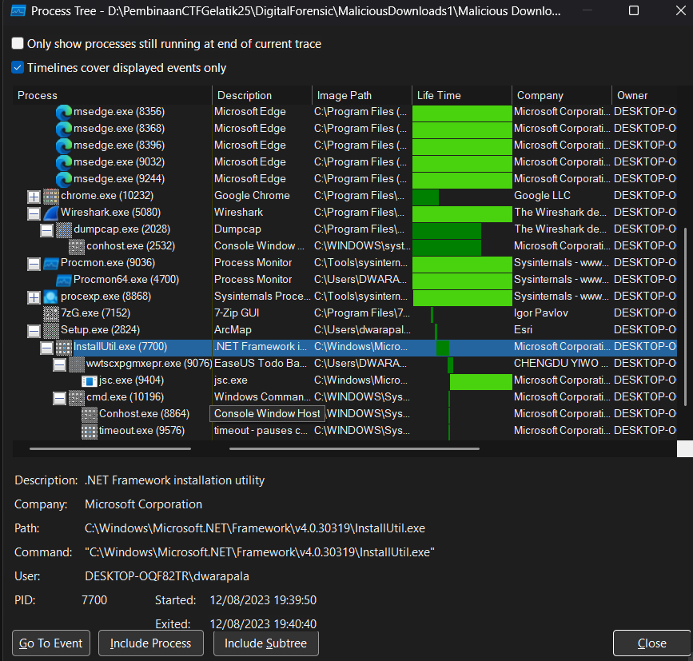

For the rest of this challenge, you have to download and use this file:

[Link Challenge](https://binusianorg-my.sharepoint.com/personal/felix_alexander_binus_ac_id/_layouts/15/guestaccess.aspx?share=Emz-mcrs9ORBkHpN3uUIKvIBBYuWAfRCVOQkByRoag2dxg&e=gX93CS)

There's a child process once the user executes the setup executable. What's the PID of it?

Flag format: LAOS{PID}

Example: LAOS{1270}

#DigitalForensic #pml #procmon #PID #pembinaan-gelatik-laos-25
___
Dalam file zip terdapat 2 file sebagai berikut:
```
┌──(kali㉿oujisan)-[/mnt/d/PembinaanCTFGelatik25/DigitalForensic/MaliciousDownloads1/Malicious Downloads]
└─$ ls
evidence.pcap  evidence.PML
```

Tujuan kali ini adalah untuk mencari PID dari child process ketika user mengeksekusi setup executable. Gunakan `Procmon` untuk melakukan analisa terhadap `evidence.PML`

Buka Process Tree untuk melihat process dan sub-process. Karena pada deskripsi soal dikatakan setup executable, jadi coba untuk cari `setup.exe`.



Disini terlihat jika `Setup.exe` memiliki sub-process yang bernama `InstallUtil.exe` dengan PID `7700`

```
LAOS{7700}
```
