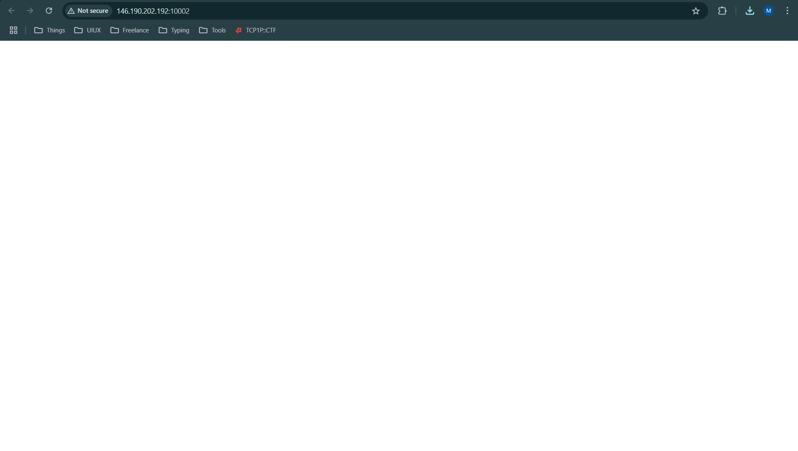
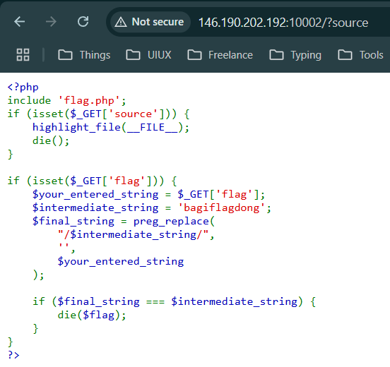
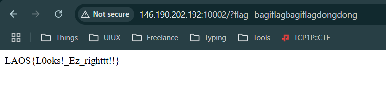

# ez-right
Just a normal php web [http://146.190.202.192:10002](http://146.190.202.192:10002/)

#webexp #php #commandinjection #wu #pembinaan-gelatik-laos-25
___
Diberi sebuah tampilan web kosong dan file `index.php`



Mari analisa point penting dari source code yang telah diberikan.
- Ketika kita mengakses `?source=` maka akan menampilkan source code
- Ketika kita mengakses `?flag=` akan dijalankan suatu program.
	- Jika `$your_entered_string` sama dengan `$intermediate_string`, string tersebut akan ditimpa dengan `''` oleh function `preg_replace()` pada `$final_string`
	- Lalu, `$final_string` akan dicek jika value dan tipe data sama dengan `$intermediate_string` akan menampilkan flag.

Kerentanan pada soal ini termasuk Command Injection, dimana seseorang mampu menyisipkan atau menulis perintah pada celah yang ada.



Untuk mendapakan flag disini harus bisa mengakali function `preg_replace()`, pengecekan yang dilakukan function diatas hanya sekali dan hanya menghilangkan string `'bagiflagdongbang'`. 

Akali dengan menulis bagian dari value `$intermediate_string` dan tambahkan string variabel tersebut secara utuh ditengah potongan stringnya seperti berikut ini `bagiflagbagiflagdongdong`.
(Sorry jelasinnya ribet ^ ^)

String tersebut terdiri dari kata "bagiflag" "bagiflagdong" "dong".
function `preg_replace()` akan menghapus string `"bagiflagdongbang"` dan string akhirnya menghasilkan "bagiflagdong". Dengan ini nilai `$final_string` akan sama dengan `$intermediate_string`.

```
http://146.190.202.192:10002/?flag=bagiflagbagiflagdongdong
```



```
LAOS{L0oks!_Ez_righttt!!}
```