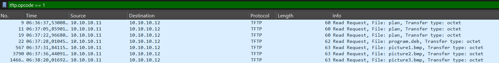
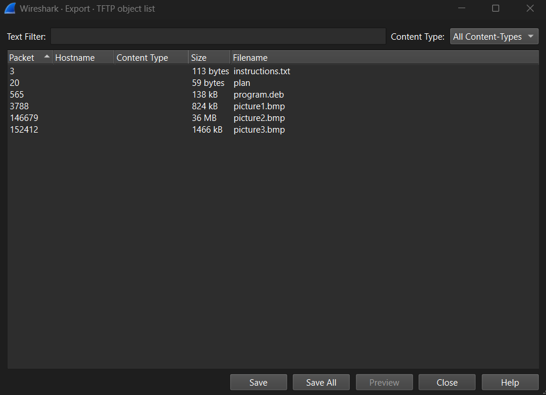

# Trivial Flag Transfer Protocol
[Link Challenge](https://play.picoctf.org/practice/challenge/103)

Figure out how they moved the [flag](https://mercury.picoctf.net/static/b686a99ec088f10b324cfe963bd32dab/tftp.pcapng).

#DigitalForensic #pcap #wu
___
Diberikan file pcap, lakukan analisa menggunakan wireshark yang diberi
```
┌──(kali㉿oujisan)-[/mnt/c/Users/Ouji/Downloads/chall]
└─$ ls
tftp.pcapng
```

Pada judul soal terdapat hint TFTP atau *Trivial Flag Transfer Protocol* yaitu Protocol sederhana untuk mentransfer file melalui jaringan menggunakan protocol UDP.

Jadi kita fokus pada protocol TFTP saja dengan melakukan filter tampilan.
```
tftp
```

Point penting setelah dianalisa adalah, pengguna beberapa kali menulis request diantaranya:
- instructions.txt
- plan
- program.deb

Untuk memastikan apakah ada lagi read request yang dilakuakan user gunakan filter `opcode` dengan code 1.
```
tftp.opcode == 1
```

`opcode` adalah operation code dan 1 merupakan read request



Ternyata selain ketiga file diatas terdapat 3 file `bmp` atau simpelnya gambar. dan 2 file plan yang apabila dilihat detailnya request tersebut gagal. Request untuk `intoduction.txt` berada pada opcode 2

Untuk mendapatkan semua file diatas dalam wireshark kita diberi kemudahan dengan klik
`File -> Export Objects -> tftp`. Nanti akan muncul window list.



Tekan `Save All` untuk menyimpan seluruh packet yang ada.

Hal ini juga dapat dilakukan pada tshark dengan cara berikut
```
tshark -r tftp.pcapng -Y 'udp.stream == {X} && !(tftp.opcode == 4)' -T fields -e data | xxd -r -p > {output}
```
- Isi `X` dengan UDP Stream dari file-file diatas satu persatu.
- `output` untuk menentukan nama output, disarankan tetap menggunakan raw type jika belum atau tidak yakin dengan tipe dari file.


Mari kita cek hasil dari export.

Intructions berisi tulisan yang kemungkinan ini adalah ROT13
```
┌──(kali㉿oujisan)-[/mnt/c/Users/Ouji/Downloads/chall/tftp]
└─$ cat instructions.txt
GSGCQBRFAGRAPELCGBHEGENSSVPFBJRZHFGQVFTHVFRBHESYNTGENAFSRE.SVTHERBHGNJNLGBUVQRGURSYNTNAQVJVYYPURPXONPXSBEGURCYNA
```

Gunakan web atau `tr 'A-Za-z' 'N-ZA-Mn-za-m'` pada terminal
```
TFTPDOESNTENCRYPTOURTRAFFICSOWEMUSTDISGUISEOURFLAGTRANSFER.FIGUREOUTAWAYTOHIDETHEFLAGANDIWILLCHECKBACKFORTHEPLAN
```

Coba beri spasi agar mudah dibaca
```
TFTP DOESNT ENCRYPT OUR TRAFFIC SO WE MUST DISGUISE OUR FLAG TRANSFER. FIGURE OUT AWAY TO HIDE THE FLAG AND I WILL CHECK BACK FOR THE PLAN
```
Informasi yang ada tidak terlalu menunjukkan hint.

Cek file plan berikutnya
```
┌──(kali㉿oujisan)-[/mnt/c/Users/Ouji/Downloads/chall/tftp]
└─$ cat plan
VHFRQGURCEBTENZNAQUVQVGJVGU-QHRQVYVTRAPR.PURPXBHGGURCUBGBF
```

Nampaknya file ini juga encode ROT13, decode aja
```
I USED THE PROGRAM AND HID IT WITH-DUE DILIGENCE. CHECK OUT THE PHOTOS
```
Ok, hint yang sangat terang sekali.

Yang ketiga adalah `program.deb` yang dikatakan mereka digunakan untuk menyembunyikan flag.
Kita cek terlebih dahulu apa sebenarnya program yang disebut
```
┌──(kali㉿oujisan)-[/mnt/c/Users/Ouji/Downloads/chall/tftp]
└─$ dpkg-deb -I program.deb
 new Debian package, version 2.0.
 size 138310 bytes: control archive=1250 bytes.
     826 bytes,    18 lines      control
    1184 bytes,    17 lines      md5sums
 Package: steghide
 Source: steghide (0.5.1-9.1)
 Version: 0.5.1-9.1+b1
 Architecture: amd64
 Maintainer: Ola Lundqvist <opal@debian.org>
 Installed-Size: 426
 ...
```

Diketahui jika file debian tersebut adalah `steghide` yang biasa digunakan untuk menyembunyikan file dalam file lain. Apabila belum install steghide bisa install melalui `.deb` ini atau melalui packet manager debian.
```
sudo dpkg -i program.deb
```

```
sudo apt install steghide
```

Karena kita mendapat hint untuk mengecek foto mari kita cek ketiga foto yang ada menggunakan steghide

```
┌──(kali㉿oujisan)-[/mnt/c/Users/Ouji/Downloads/chall/tftp]
└─$ steghide extract -sf picture1.bmp
Enter passphrase:
steghide: could not extract any data with that passphrase!
```

Ternyata diperlukan password untuk membuka file rahasia pada `.bmp` ini. Pertanyaannya, dari mana kita bisa mendapatkan password?

Apabila kita sedikit fokus dan jeli, pada pesan plan diatas terdapat kalimat yang bisa dijadikan kandidat password yaitu pada kalimat awal berikut
```
I USED THE PROGRAM AND HID IT WITH-DUE DILIGENCE
```

"HIT ID WITH-DUE DILIGENCE". Normalnya pada kalimat lain tidak ada pembatas `-` karena memang bentuk awalnya adalah tidak ada spasi. jadi coba untuk memasukkan `DUEDILIGENCE` sebagai password dengan tetap capslock dan tidak spasi.

```
┌──(kali㉿oujisan)-[/mnt/c/Users/Ouji/Downloads/chall/tftp]
└─$ steghide extract -sf picture1.bmp -p "DUEDILIGENCE"
steghide: could not extract any data with that passphrase!

┌──(kali㉿oujisan)-[/mnt/c/Users/Ouji/Downloads/chall/tftp]
└─$ steghide extract -sf picture2.bmp -p "DUEDILIGENCE"
steghide: could not extract any data with that passphrase!

┌──(kali㉿oujisan)-[/mnt/c/Users/Ouji/Downloads/chall/tftp]
└─$ steghide extract -sf picture3.bmp -p "DUEDILIGENCE"
wrote extracted data to "flag.txt".
```

Yap, pada gambar ketiga berhasil extract `flag.txt`, cat aja
```
┌──(kali㉿oujisan)-[/mnt/c/Users/Ouji/Downloads/chall/tftp]
└─$ cat flag.txt
picoCTF{h1dd3n_1n_pLa1n_51GHT_18375919}
```

Absolute Chinema :v

```
picoCTF{h1dd3n_1n_pLa1n_51GHT_18375919}
```