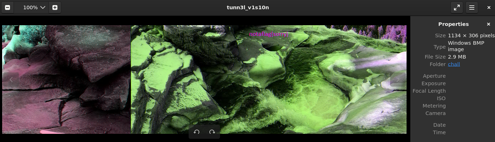
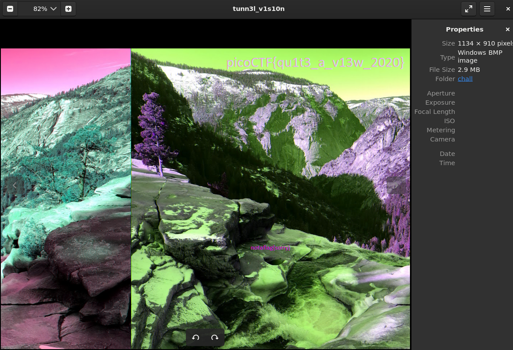

# Tunn3l V1s10n
[Link Challenge](https://play.picoctf.org/practice/challenge/112)

We found this [file](https://mercury.picoctf.net/static/09a86202e72dbdb5bf4d1b5d2c6a5b86/tunn3l_v1s10n). Recover the flag.

#Forensic #wu #png 
___
```
┌──(kali㉿oujisan)-[/mnt/c/Users/Ouji/Downloads/chall]
└─$ ls
tunn3l_v1s10n
```

```
┌──(kali㉿oujisan)-[/mnt/c/Users/Ouji/Downloads/chall]
└─$ xxd tunn3l_v1s10n | head
00000000: 424d 8e26 2c00 0000 0000 bad0 0000 bad0  BM.&,...........
00000010: 0000 6e04 0000 3201 0000 0100 1800 0000  ..n...2.........
00000020: 0000 5826 2c00 2516 0000 2516 0000 0000  ..X&,.%...%.....
00000030: 0000 0000 0000 231a 1727 1e1b 2920 1d2a  ......#..'..) .*
00000040: 211e 261d 1a31 2825 352c 2933 2a27 382f  !.&..1(%5,)3*'8/
00000050: 2c2f 2623 332a 262d 2420 3b32 2e32 2925  ,/&#3*&-$ ;2.2)%
00000060: 3027 2333 2a26 382c 2836 2b27 392d 2b2f  0'#3*&8,(6+'9-+/
00000070: 2623 1d12 0e23 1711 2916 0e55 3d31 9776  &#...#..)..U=1.v
00000080: 668b 6652 996d 569e 7058 9e6f 549c 6f54  f.fR.mV.pX.oT.oT
00000090: ab7e 63ba 8c6d bd8a 69c8 9771 c193 71c1  .~c..m..i..q..q.
```

Disini file memiliki hex `424D` yang merupakan signature dari file `BMP`. Namun, file ini rusak jadi tidak dapat dibuka. Kita coba perbaiki hexnya dengan referensi berikut [BMP File Format](https://gibberlings3.github.io/iesdp/file_formats/ie_formats/bmp.htm) 
Point penting jika BMP cara baca datanya mulai bawah ke atas.

- Signature - `42 4D` = BM
- File Size - `8E 26 2C 00` = 2893454 bytes / 2.76 MB
- Data Offset - `BA D0 00 00` = 53434 bytes
- Header Size - `BA D0 00 00` = 53434 bytes
- Width - `6E 04 00 00` = 1134
- Height - `32 01 00 00` = 306

Ok, dari sini sudah ada yang aneh.  Dimana? apabila diperhatikan pada referensi, Jumlah Header Size adalah 40, tetapi pada file ini `53434` bytes. over banget weh...
Ubah jadi 40 atau `28`. Karena penulisan dari bawah ke atas dan terdiri dari 4 bytes jadi seperti berikut `28 00 00 00`.



Kita mendapat dummy flag `notaflag{sorry}`

Karena tidak mendapatkan hint lain, namun sepertinya gambar tersebut terpotong karena posisinya sangat panjang namun tingginya kurang sekali. Jadi, coba untuk mengubah height dari foto diatas dari `32 01 00 00` menjadi 1000 atau `8E 03 00 00`



```
picoCTF{qu1t3_a_v13w_2020}
```
