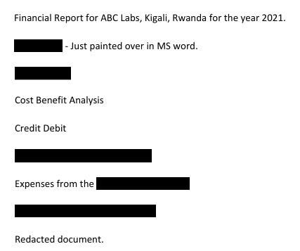

# Redaction gone wrong
[Link Challenge](https://play.picoctf.org/practice/challenge/48)

Now you DON’T see me.This [report](https://artifacts.picoctf.net/c/84/Financial_Report_for_ABC_Labs.pdf) has some critical data in it, some of which have been redacted correctly, while some were not. Can you find an important key that was not redacted properly?

#Forensic #pdf #wu 
___
```
┌──(kali㉿oujisan)-[/mnt/c/Users/Ouji/Downloads/chall]
└─$ ls
Financial_Report_for_ABC_Labs.pdf
```

Cek `file` seperti biasa
```
┌──(kali㉿oujisan)-[/mnt/c/Users/Ouji/Downloads/chall]
└─$ file Financial_Report_for_ABC_Labs.pdf
Financial_Report_for_ABC_Labs.pdf: PDF document, version 1.7, 1 page(s)
```

Buka pdf untuk mengecek isi file


Kotak hitam dalam pdf ini dinamakan redacted. Setelah cara melihat atau membaca teks yang tertutupi kotak hitam bisa menggunakan tools GUI dan CLI. Coba pakai cli dulu.
```
sudo apt install poppler-utils
```

```
┌──(kali㉿oujisan)-[/mnt/c/Users/Ouji/Downloads/chall]
└─$ pdftotext Financial_Report_for_ABC_Labs.pdf output.txt
```

Ketemu dah
```
┌──(kali㉿oujisan)-[/mnt/c/Users/Ouji/Downloads/chall]
└─$ cat output.txt
Financial Report for ABC Labs, Kigali, Rwanda for the year 2021.
Breakdown - Just painted over in MS word.

Cost Benefit Analysis
Credit Debit
This is not the flag, keep looking
Expenses from the
picoCTF{C4n_Y0u_S33_m3_fully}
Redacted document.
```

Versi lebih rapi
```
┌──(kali㉿oujisan)-[/mnt/c/Users/Ouji/Downloads/chall]
└─$ cat output.txt | grep -o "picoCTF{.*}"
picoCTF{C4n_Y0u_S33_m3_fully}
```

```
picoCTF{C4n_Y0u_S33_m3_fully}
```