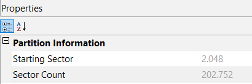

# Sleuthkit Intro
[Link Challenge](https://play.picoctf.org/practice/challenge/301)

Download the disk image and use `mmls` on it to find the size of the Linux partition. Connect to the remote checker service to check your answer and get the flag.Note: if you are using the webshell, download and extract the disk image into `/tmp` not your home directory.[Download disk image](https://artifacts.picoctf.net/c/164/disk.img.gz)Access checker program: `nc saturn.picoctf.net xxxxx`

#DigitalForensic #ImageForensic #img #ftk-imager 
___
```
┌──(kali㉿oujisan)-[/mnt/c/Users/Ouji/Downloads/chall/disk.img]
└─$ ls
disk.img
```

Buka menggunakan FTK Imager untuk menganalisa dan jalankan instance pada soal.
Terdapat pertanyaan sebagai berikut:
```
┌──(kali㉿oujisan)-[/mnt/c/Users/Ouji/Downloads/chall/disk.img]
└─$ nc saturn.picoctf.net 54515
What is the size of the Linux partition in the given disk image?
Length in sectors:
```

Untuk mengetahui ukuran partisi dari linux, klik partition satu lalu cek bagian Properties Partition Information. Disitu terdapat sector count, masukkan aja



```
┌──(kali㉿oujisan)-[/mnt/c/Users/Ouji/Downloads/chall/disk.img]
└─$ nc saturn.picoctf.net 54515
What is the size of the Linux partition in the given disk image?
Length in sectors: 202752
202752
Great work!
picoCTF{mm15_f7w!}
```

```
picoCTF{mm15_f7w!}
```
