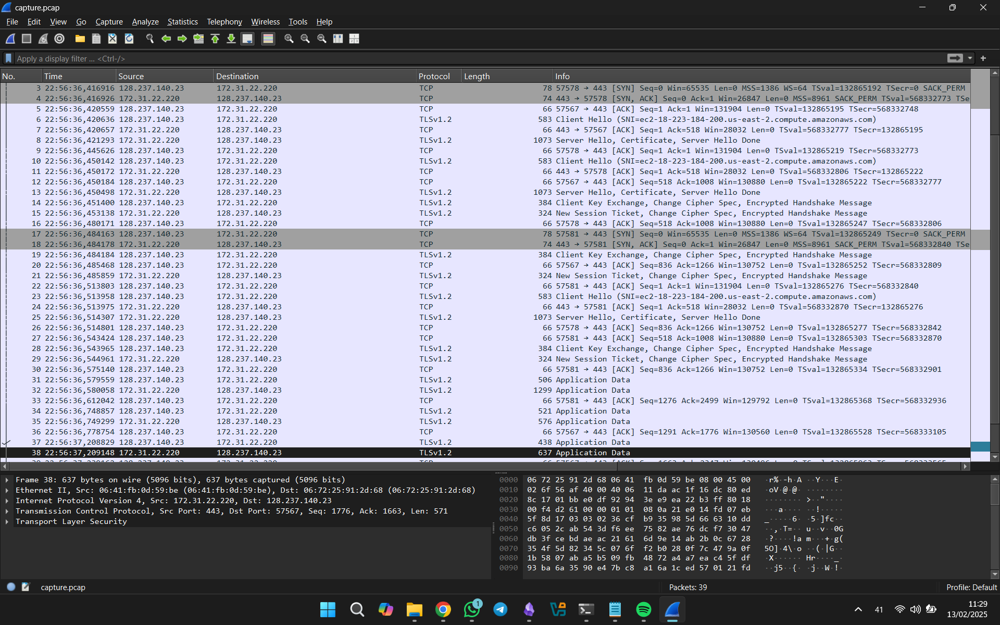
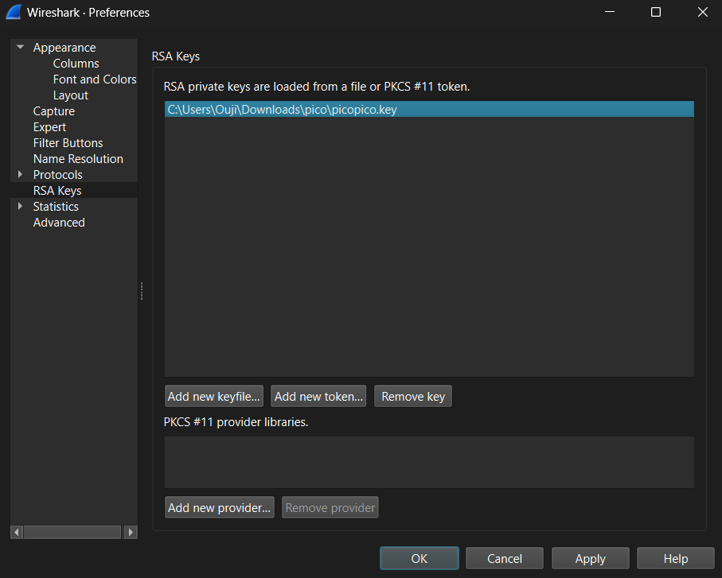
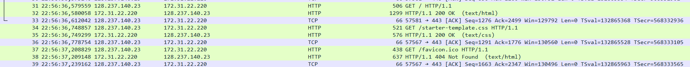

# WebNet0
[Link Challenge](https://play.picoctf.org/practice/challenge/32)

We found this [packet capture](https://jupiter.challenges.picoctf.org/static/0c84d3636dd088d9fe4efd5d0d869a06/capture.pcap) and [key](https://jupiter.challenges.picoctf.org/static/0c84d3636dd088d9fe4efd5d0d869a06/picopico.key). Recover the flag.

#DigitalForensic #wu #pcap
___
```
┌──(kali㉿oujisan)-[/mnt/c/Users/Ouji/Downloads/pico]
└─$ ls
capture.pcap  picopico.key
```

Analisa file pcap menggunakan wireshark. Selain itu, kita mendapatkan `.key` file yang berisi prvate key.



Dalam wireshark tidak ada yang bisa di dapat selain informasi biasa. Setelah mencari hubungan antara key dan pcap, ternyata kita bisa melakukan decrypt untuk melihat TLS-Encrypted Traffic.

Pada wireshark, buka menu `Edit -> Preferences -> RSA Key` Masukkan file `picopico.key` melalui `Add new Keyfile` lalu tekan `Apply`.



Tekan `Ctrl + R` untuk refresh package. Makan akan muncul traffic baru dengan protocol `HTTP`



Lakukan HTTP Stream untuk menganalisa.
```
HTTP/1.1 200 OK
Date: Fri, 23 Aug 2019 15:56:36 GMT
Server: Apache/2.4.29 (Ubuntu)
Last-Modified: Mon, 12 Aug 2019 16:50:05 GMT
ETag: "5ff-58fee50dc3fb0-gzip"
Accept-Ranges: bytes
Vary: Accept-Encoding
Content-Encoding: gzip
Pico-Flag: picoCTF{nongshim.shrimp.crackers}
Content-Length: 821
Keep-Alive: timeout=5, max=100
Connection: Keep-Alive
Content-Type: text/html
```

Pada bagian header, ternyata ada flagnya
```
picoCTF{nongshim.shrimp.crackers}
```