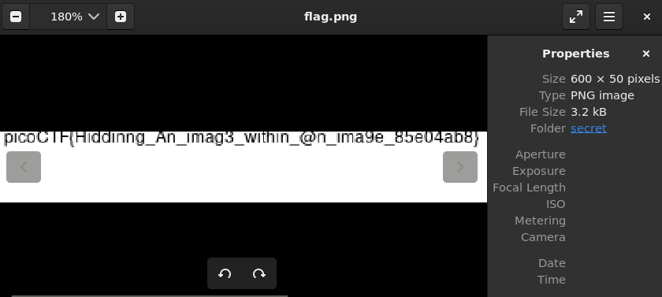

# hideme
[Link Challenge](https://play.picoctf.org/practice/challenge/350)

Every file gets a flag.The SOC analyst saw one image been sent back and forth between two people. They decided to investigate and found out that there was more than what meets the eye [here](https://artifacts.picoctf.net/c/256/flag.png).

#Forensic #wu #steganography 
___
Analisa file `flag.png` yang diberikan. Setelah melakukan analisa menggunakan `file`, `exiftool` tidak ditemukan clue.

Ketika menggunakan `biwalk`, ditemukan jika ada file `.zip` tersembunyi didalamnya.
```
DECIMAL       HEXADECIMAL     DESCRIPTION
--------------------------------------------------------------------------------
0             0x0             PNG image, 512 x 504, 8-bit/color RGBA, non-interlaced
41            0x29            Zlib compressed data, compressed
39739         0x9B3B          Zip archive data, at least v1.0 to extract, name: secret/
39804         0x9B7C          Zip archive data, at least v2.0 to extract, compressed size: 2997, uncompressed size: 3152, name: secret/flag.png
43036         0xA81C          End of Zip archive, footer length: 22
```

ekstrak file dari png dan zip yang ada.
```
┌──(kali㉿oujisan)-[/mnt/c/Users/Ouji/Downloads/chall]
└─$ binwalk --dd='.*' flag.png
```

```
┌──(kali㉿oujisan)-[/mnt/c/Users/Ouji/Downloads/chall/_flag.png.extracted]
└─$ unzip 9B3B
Archive:  9B3B
   creating: secret/
  inflating: secret/flag.png
```

Terdapat folder `secret` dengan file `flag.png` didalamnya. Buka aja


```
picoCTF{Hiddinng_An_imag3_within_@n_ima9e_85e04ab8}
```
