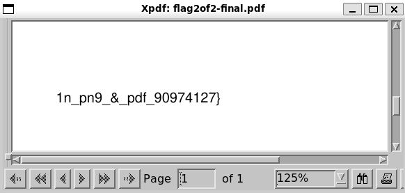
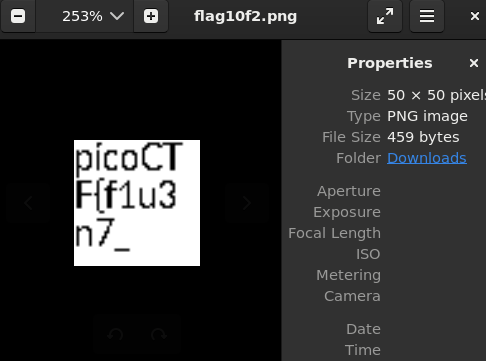

# Secret of the Polyglot
[Link Challenge](https://play.picoctf.org/practice/challenge/423)

The Network Operations Center (NOC) of your local institution picked up a suspicious file, they're getting conflicting information on what type of file it is. They've brought you in as an external expert to examine the file. Can you extract all the information from this strange file?Download the suspicious file [here](https://artifacts.picoctf.net/c_titan/96/flag2of2-final.pdf).

#DigitalForensic #png #pdf #steganography 
___
Cek file pdf yang telah didownload.
```
┌──(kali㉿oujisan)-[/mnt/c/Users/Ouji/Downloads]
└─$ file flag2of2-final.pdf
flag2of2-final.pdf: PNG image data, 50 x 50, 8-bit/color RGBA, non-interlaced
```

File memiliki ekstensi tapi tertulis PNG image disana.
Dari nama file, didapatkan hint kalau flag terpisah 2 bagian. Buka file diatas
```
┌──(kali㉿oujisan)-[/mnt/c/Users/Ouji/Downloads]
└─$ xpdf flag2of2-final.pdf
```



Kita dapatkan potongan kedua dari flag, potongan pertama kemungkinan besar terdapat pada file png.

walaupun tulisan ekstensi file tersebut adalah `.pdf` namun sebenarnya terdapat file `.png`. didalamnya
Ubah file pdf menjadi PNG menggunakan `imagick`.
```
┌──(kali㉿oujisan)-[/mnt/c/Users/Ouji/Downloads]
└─$ convert flag2of2-final.pdf flag10f2.png
convert-im6.q16: profile 'icc': 'RGB ': RGB color space not permitted on grayscale PNG `flag10f2.png' @ warning/png.c/MagickPNGWarningHandler/1669.
```

atau bisa menggunakan `binwalk` untuk ekstrak seluruh isi dalam file tersebut
```
┌──(kali㉿oujisan)-[/mnt/c/Users/Ouji/Downloads]
└─$ binwalk --dd=".*" flag2of2-final.pdf

DECIMAL       HEXADECIMAL     DESCRIPTION
--------------------------------------------------------------------------------
0             0x0             PNG image, 50 x 50, 8-bit/color RGBA, non-interlaced
914           0x392           PDF document, version: "1.4"
1149          0x47D           Zlib compressed data, default compression
```

Buka file PNG
```
┌──(kali㉿oujisan)-[/mnt/c/Users/Ouji/Downloads]
└─$ eog flag10f2.png
```



Sambungkan aja dah *(Malas kali nulis manual gini wak :v)*

```
picoCTF{f1u3n7_1n_pn9_&_pdf_90974127}
```
