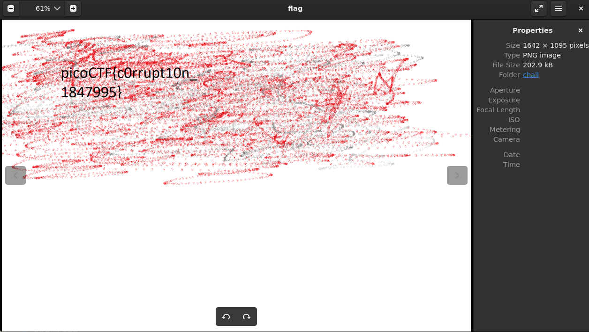

# c0rrupt
[Link Challenge](https://play.picoctf.org/practice/challenge/53)

We found this [file](https://jupiter.challenges.picoctf.org/static/ab30fcb7d47364b4190a7d3d40edb551/mystery). Recover the flag.

#DigitalForensic #wu #png 
___
```
┌──(kali㉿oujisan)-[/mnt/c/Users/Ouji/Downloads/chall]
└─$ ls
mystery
```

Setelah di analisa, didapatkan bahwa pada file ini memiliki header yang rusak.
```
┌──(kali㉿oujisan)-[/mnt/c/Users/Ouji/Downloads/chall]
└─$ xxd mystery | head
00000000: 8965 4e34 0d0a b0aa 0000 000d 4322 4452  .eN4........C"DR
00000010: 0000 066a 0000 0447 0802 0000 007c 8bab  ...j...G.....|..
00000020: 7800 0000 0173 5247 4200 aece 1ce9 0000  x....sRGB.......
00000030: 0004 6741 4d41 0000 b18f 0bfc 6105 0000  ..gAMA......a...
00000040: 0009 7048 5973 aa00 1625 0000 1625 0149  ..pHYs...%...%.I
00000050: 5224 f0aa aaff a5ab 4445 5478 5eec bd3f  R$......DETx^..?
00000060: 8e64 cd71 bd2d 8b20 2080 9041 8302 08d0  .d.q.-.  ..A....
00000070: f9ed 40a0 f36e 407b 9023 8f1e d720 8b3e  ..@..n@{.#... .>
00000080: b7c1 0d70 0374 b503 ae41 6bf8 bea8 fbdc  ...p.t...Ak.....
00000090: 3e7d 2a22 336f de5b 55dd 3d3d f920 9188  >}*"3o.[U.==. ..
```

Dari head yang ada, bisa disimpulkan bahwa ini adalah file png. Bisa dilihat dari
- `eN4` - `PNG`
- `C"DR` - `IHDR`
- Terdapatnya sRGB, gAMA, pHYs
- `DETx` - `IDAT`

Lebih lengkapnya bisa baca pada panduan berikut ini: [PNG Structure](https://medium.com/@0xwan/png-structure-for-beginner-8363ce2a9f73)
Gunakan Hex Editor untuk memperbaiki header file.

1. Perbaiki hex signature file
File signature PNG berada pada 8 bytes pertama yang memiliki hex `89 50 4E 47 0D 0A 1A 0A`.
```
8950 4e47 0d0a 1a0a 0000 000d 4948 4452  .PNG........IHDR
```

2. Perbaiki Chunk IHDR
Posisi chunk IHDR terletak setelah 8 bytes signature file. Urutannya adalah:
- 4 bytes ukuran chunk
- 4 bytes tipe chunk
- Chunk data (tergantung pada ukuran chunk pada point pertama)
- 4 chunk CRC

Untuk ukuran chunks tidak ada masalah, karena chunk IHDR terdiri dari 13 bytes atau 0D jika dilambangkan pada hexadesimal.

Tipe Chunk IHDR normalnya memiliki hex `49 48 44 52`. Perbaiki bagian ini
```
8950 4e47 0d0a 1a0a 0000 000d 4948 4452  .PNG........IHDR
0000 066a 0000 0447 0802 0000 007c 8bab  ...j...G.....|..
```
dan tampaknya tidak ada yang perlu diubah lagi pada chunk IHDR

3. Perbaiki IDAT Chunk
IDAT juga memiliki urutan penempatan yang sama dengan IHDR Chunk mulai dari ukuran chunk hingga CRC,  yang membedakan adalah ukuran chunk nya lebih besar. 

IDAT Chunk seharusnya memiliki hex `49 44 41 54`.
```
5224 f0aa aaff a549 4441 5478 5eec bd3f  R$.....IDATx^..?
```

Setelah diperbaiki, cek dengan `pngcheck` pada terminal untuk melihat apakah file sudah benar atau belum.
```
┌──(kali㉿oujisan)-[/mnt/c/Users/Ouji/Downloads/chall]
└─$ pngcheck -v flag
zlib warning:  different version (expected 1.2.13, using 1.3.1)

File: flag (202940 bytes)
  chunk IHDR at offset 0x0000c, length 13
    1642 x 1095 image, 24-bit RGB, non-interlaced
  chunk sRGB at offset 0x00025, length 1
    rendering intent = perceptual
  chunk gAMA at offset 0x00032, length 4: 0.45455
  chunk pHYs at offset 0x00042, length 9: 2852132389x5669 pixels/meter
  CRC error in chunk pHYs (computed 38d82c82, expected 495224f0)
ERRORS DETECTED in flag
```

Error disini disebabkan ukuran chunk `pHYs` tidak valid karena terlalu besar. ubah `2852132389` menjadi hexadesimal.  Didapatkan `AA 00 16 25`. Cari hex dengan ukuran segitu pada chunk pHYs serta ganti menjadi 5669 atau `00 00 16 25` agar sama dengan height pada pixelnya.
```
0009 7048 5973 0000 1625 0000 1625 0149  ..pHYs...%...%.I
```

Selanjutnya kita ubah ukuran dari ukuran IDAT Chunk yang terlalu besar yaitu `2863333285` atau `AA AA FF A5` menjadi `00 00 FF A5`

```
┌──(kali㉿oujisan)-[/mnt/c/Users/Ouji/Downloads/chall]
└─$ pngcheck -v flag
zlib warning:  different version (expected 1.2.13, using 1.3.1)

File: flag (202940 bytes)
  chunk IHDR at offset 0x0000c, length 13
    1642 x 1095 image, 24-bit RGB, non-interlaced
  chunk sRGB at offset 0x00025, length 1
    rendering intent = perceptual
  chunk gAMA at offset 0x00032, length 4: 0.45455
  chunk pHYs at offset 0x00042, length 9: 5669x5669 pixels/meter (144 dpi)
  chunk IDAT at offset 0x00057, length 65445
    zlib: deflated, 32K window, fast compression
  chunk IDAT at offset 0x10008, length 65524
  chunk IDAT at offset 0x20008, length 65524
  chunk IDAT at offset 0x30008, length 6304
  chunk IEND at offset 0x318b4, length 0
No errors detected in flag (9 chunks, 96.3% compression).
```

Ketika sudah tidak ada error, coba buka png file.


```
picoCTF{c0rrupt10n_1847995}
```