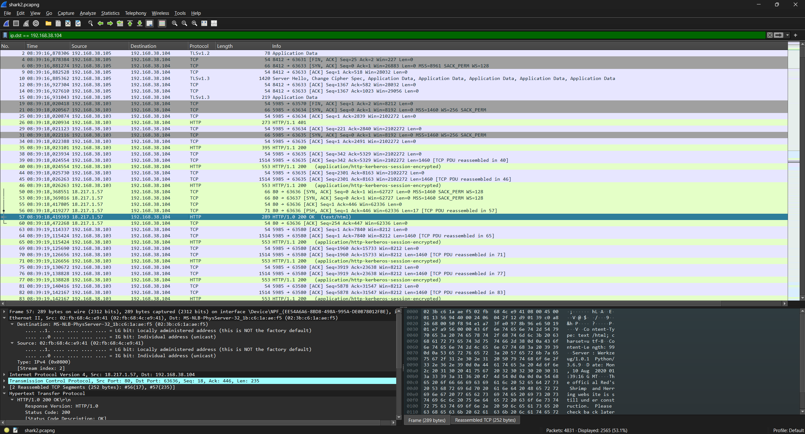
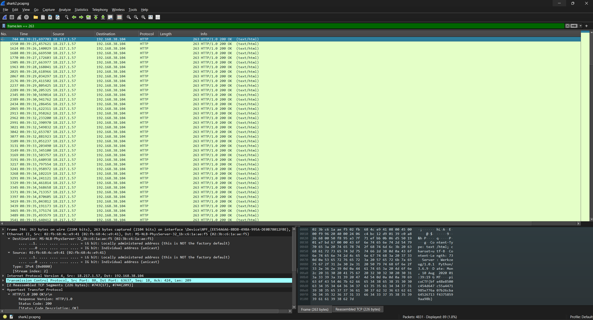
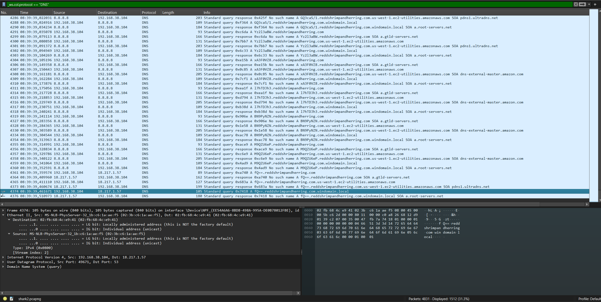
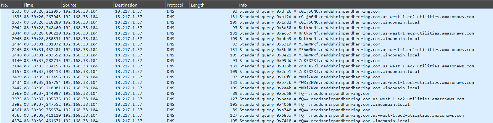

# Wireshark-twoo-twooo-two-twoo
[Link Challenge](https://play.picoctf.org/practice/challenge/110)

Can you find the flag? [shark2.pcapng](https://mercury.picoctf.net/static/719e81d6fbb6b3157624268588fc0de8/shark2.pcapng).

#DigitalForensic #pcap #wu
___
```
┌──(kali㉿oujisan)-[/mnt/c/Users/Ouji/Downloads/chall]
└─$ ls
shark2.pcapng
```

Buka wireshark untuk melakukan analisa.

Disini aku melakukan filter terhadap IP `192.168.38.104` karena terlihat melakukan aktivitas
```
ip.dst == 192.168.38.104
```

Disini terlihat, mereka menerima text/html.


Setelah discroll terdapat lebih dari satu text/html yang memuat flag tetapi tidak terlihat seperti flag yang benar.
```
0000   02 3b c6 1a ae f5 02 fb 68 4c e9 41 08 00 45 00   .;......hL.A..E.
0010   00 f9 96 20 40 00 24 06 c4 bc 12 d9 01 39 c0 a8   ... @.$......9..
0020   26 68 00 50 f8 95 a3 7f 71 ef bb 0b 06 d5 50 19   &h.P....q.....P.
0030   01 e7 bd 67 00 00 43 6f 6e 74 65 6e 74 2d 54 79   ...g..Content-Ty
0040   70 65 3a 20 74 65 78 74 2f 68 74 6d 6c 3b 20 63   pe: text/html; c
0050   68 61 72 73 65 74 3d 75 74 66 2d 38 0d 0a 43 6f   harset=utf-8..Co
0060   6e 74 65 6e 74 2d 4c 65 6e 67 74 68 3a 20 37 33   ntent-Length: 73
0070   0d 0a 53 65 72 76 65 72 3a 20 57 65 72 6b 7a 65   ..Server: Werkze
0080   75 67 2f 31 2e 30 2e 31 20 50 79 74 68 6f 6e 2f   ug/1.0.1 Python/
0090   33 2e 36 2e 39 0d 0a 44 61 74 65 3a 20 4d 6f 6e   3.6.9..Date: Mon
00a0   2c 20 31 30 20 41 75 67 20 32 30 32 30 20 30 31   , 10 Aug 2020 01
00b0   3a 33 39 3a 31 39 20 47 4d 54 0d 0a 0d 0a 70 69   :39:19 GMT....pi
00c0   63 6f 43 54 46 7b 62 66 65 34 38 65 38 35 30 30   coCTF{bfe48e8500
00d0   63 34 35 34 64 36 34 37 63 35 35 61 34 34 37 31   c454d647c55a4471
00e0   39 38 35 65 37 37 36 61 30 37 62 32 36 63 62 61   985e776a07b26cba
00f0   36 34 35 32 36 37 31 33 66 34 33 37 35 38 35 39   64526713f4375859
0100   39 61 61 39 38 62 7d                              9aa98b}
```

Ternyata ada banyak yang serupa dengan banyak yang mengandung format file dummy atau palsu.


Coba untuk cari hint lainnya.
Disini mencoba untuk mencari pada protocol DNS.
```
_ws.col.protocol == "DNS"
```



Setelah ditelusuri pada bagian paling bawah terdapat `fQ==.reddshrimpandherring.com`
yang membuat aneh adalah `fQ==` yang biasanya merupakan akhiran dari base64 dan lagi terletak di awal suatu domain. Ketika dicek tidak ada domain dengan awalan `fQ==`. Adanya langsung `reddshrimpandherring.com`. Coba untuk filter berfokus destination dari alamat.

```
(ip.dst == 18.217.1.57) && (_ws.col.protocol == "DNS")
```


Pada setiap awal domain terlihat pola yang sama. Coba susun dan decode menggunakan base64

```
cGljb0NU reddshrimpandherringcom
RntkbnNf reddshrimpandherringcom
M3hmMWxf reddshrimpandherringcom
ZnR3X2Rl reddshrimpandherringcom
YWRiZWVm reddshrimpandherringcom
fQ== reddshrimpandherringcom
```

```
┌──(kali㉿oujisan)-[/mnt/c/Users/Ouji/Downloads/chall]
└─$ echo "cGljb0NURntkbnNfM3hmMWxfZnR3X2RlYWRiZWVmfQ==" | base64 -d
picoCTF{dns_3xf1l_ftw_deadbeef}
```
