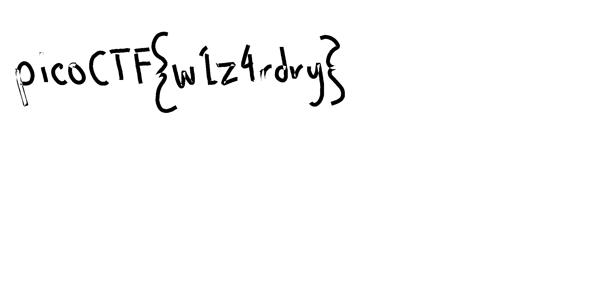

# advanced-potion-making
[Link Challenge](https://play.picoctf.org/practice/challenge/205)

Ron just found his own copy of advanced potion making, but its been corrupted by some kind of spell. Help him recover it!

#Forensic #png #wu
___
```
┌──(kali㉿oujisan)-[/mnt/c/Users/Ouji/Downloads/chall]
└─$ ls
advanced-potion-making
```

Tampaknya ini adalah file PNG yang rusak
```
┌──(kali㉿oujisan)-[/mnt/c/Users/Ouji/Downloads/chall]
└─$ xxd advanced-potion-making | head
00000000: 8950 4211 0d0a 1a0a 0012 1314 4948 4452  .PB.........IHDR
00000010: 0000 0990 0000 04d8 0802 0000 0004 2de7  ..............-.
00000020: 7800 0000 0173 5247 4200 aece 1ce9 0000  x....sRGB.......
00000030: 0004 6741 4d41 0000 b18f 0bfc 6105 0000  ..gAMA......a...
00000040: 0009 7048 5973 0000 1625 0000 1625 0149  ..pHYs...%...%.I
00000050: 5224 f000 0076 3949 4441 5478 5eec fd61  R$...v9IDATx^..a
00000060: 72e3 4c94 a659 ce16 6afe 76cd fe57 d7dd  r.L..Y..j.v..W..
00000070: 5b18 45e9 4b8a 7a28 d19d 2048 07a9 6376  [.E.K.z(.. H..cv
00000080: ac2d 2b3e bfaf 5f07 1801 82d7 b2f3 fff3  .-+>.._.........
00000090: fffc 7fff 7f00 0000 0000 0000 4b18 5802  ............K.X.
```

Mari perbaiki file ini dengan referensi [PNG Structure](https://medium.com/@0xwan/png-structure-for-beginner-8363ce2a9f73) .

Perbaiki file signature pada 8-bytes pertama
```
8950 4e47 0d0a 1a0a 0012 1314 4948 4452  .PNG........IHDR
```

cek
```
┌──(kali㉿oujisan)-[/mnt/c/Users/Ouji/Downloads/chall]
└─$ pngcheck -v flag
zlib warning:  different version (expected 1.2.13, using 1.3.1)

File: flag (30372 bytes)
  chunk IHDR at offset 0x0000c, length 1184532:  EOF while reading data
ERRORS DETECTED in flag
```
Error karena panjang chunk IHDR yang tidak valid, normalnya panjang chunk IHDR adalah 13 bytes atau `00 00 00 0D`.

```
┌──(kali㉿oujisan)-[/mnt/c/Users/Ouji/Downloads/chall]
└─$ pngcheck -v flag
zlib warning:  different version (expected 1.2.13, using 1.3.1)

File: flag (30372 bytes)
  chunk IHDR at offset 0x0000c, length 13
    2448 x 1240 image, 24-bit RGB, non-interlaced
  chunk sRGB at offset 0x00025, length 1
    rendering intent = perceptual
  chunk gAMA at offset 0x00032, length 4: 0.45455
  chunk pHYs at offset 0x00042, length 9: 5669x5669 pixels/meter (144 dpi)
  chunk IDAT at offset 0x00057, length 30265
    zlib: deflated, 32K window, fast compression
  chunk IEND at offset 0x0769c, length 0
No errors detected in flag (6 chunks, 99.7% compression).
```

Karena tidak ada yang error buka aja filenya


Ketika dibuka menggunakan eog, file berisi warna merah pekat dan tidak terlihat apa2. disini coba untuk upload pada [stegOnline](https://georgeom.net/StegOnline/upload). lalu tekan Bit Brose Plane pada red 0



```
picoCTF{w1z4rdry}
```