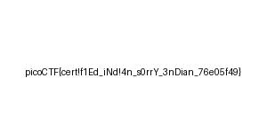

# Endianness-v2
[Link Challenge](https://play.picoctf.org/practice/challenge/415)

Here's a file that was recovered from a 32-bits system that organized the bytes a weird way. We're not even sure what type of file it is.Download it [here](https://artifacts.picoctf.net/c_titan/37/challengefile) and see what you can get out of it

#endianness #Forensic #wu 
___
```
┌──(kali㉿oujisan)-[/mnt/c/Users/Ouji/Downloads/chall]
└─$ ls
challengefile
```

Diberi file dengan tipe data tanpa ekstensi.
```
┌──(kali㉿oujisan)-[/mnt/c/Users/Ouji/Downloads/chall]
└─$ file challengefile
challengefile: data
```

Ketika dicek hex juga tidak menunjukkan adanya header tipe file.
```
┌──(kali㉿oujisan)-[/mnt/c/Users/Ouji/Downloads/chall]
└─$ xxd challengefile | head
00000000: e0ff d8ff 464a 1000 0100 4649 0100 0001  ....FJ....FI....
00000010: 0000 0100 4300 dbff 0606 0800 0805 0607  ....C...........
00000020: 0907 0707 0c0a 0809 0b0c 0d14 1219 0c0b  ................
00000030: 1d14 0f13 1d1e 1f1a 201c 1c1a 2027 2e24  ........ ... '.$
00000040: 1c23 2c22 2937 281c 3431 302c 271f 3434  .#,")7(.410,'.44
00000050: 3238 3d39 3433 2e3c 00db ff32 0909 0143  28=943.<...2...C
00000060: 0c0b 0c09 180d 0d18 211c 2132 3232 3232  ........!.!22222
00000070: 3232 3232 3232 3232 3232 3232 3232 3232  2222222222222222
00000080: 3232 3232 3232 3232 3232 3232 3232 3232  2222222222222222
00000090: 3232 3232 3232 3232 3232 3232 c0ff 3232  222222222222..22
```

Namun, pada 4 byte awal file terlihat seperti signature hexadesimal dari JPG atau JFIF file namun dalam keadaan terbalik. (`FF D8 FF E0)
```
e0ff d8ff
```

Dari judul soal juga terdapat hint `Endianess`.

Endianess adalah urutan penempatan dari data ke dalam memory. Dalam endian terdapat Little-endian dan Big-endian. Walaupun kita tidak mengetahui apakah ini little endian atau big endian, tidak masalah karena jika kita balik little endian akan menjadi big endian dan sebaliknya.

Secara teori untuk membalik kita harus mengambil setiap 4 bytes
```
e0 ff d8 ff
```

lalu membaliknya dari urutan belakang
```
ff d8 ff e0
```
dan seterusnya hingga byte terakhir pada file.

Untuk mempermudah, [oujisan](https://github.com/oujisan) telah membuat skrip sederhana untuk melakukan pembalikan bytes yang bernama [RevEndian](https://github.com/oujisan/RevEndian)
Karena kita sudah mengetahui signature file tersebut adalah jpg, maka kita langsung berikan output gambar jpg.
```
python revendian.py -f ..\..\..\Downloads\chall\challengefile flag.jpg
```



Gunakan `tesseract` untuk membantu menulis flag
```
┌──(kali㉿oujisan)-[/mnt/c/Users/Ouji/Downloads/chall]
└─$ tesseract ../../Desktop/cli-tools/RevEndian/flag.jpg stdout
Estimating resolution as 112
picoOTFloertiMlEd_iNdl4n_sOrr¥_3nDian 76205149)
```
Perbaiki kesalahan penulisan flag yang dikarenakan keburikan gambar

```
picoCTF{cert!f1Ed_iNd!4n_s0rrY_3nDian_76e05f49}
```
