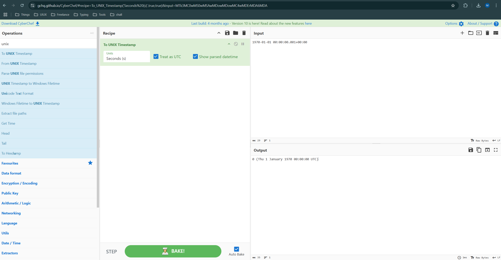

# Blast from the past
[Link Challenge](https://play.picoctf.org/practice/challenge/432)

The judge for these pictures is a real fan of antiques. Can you age this photo to the specifications?Set the timestamps on this picture to `1970:01:01 00:00:00.001+00:00` with as much precision as possible for each timestamp. In this example, `+00:00` is a timezone adjustment. Any timezone is acceptable as long as the time is equivalent. As an example, this timestamp is acceptable as well: `1969:12:31 19:00:00.001-05:00`. For timestamps without a timezone adjustment, put them in GMT time (+00:00). The checker program provides the timestamp needed for each.Use this [picture](https://artifacts.picoctf.net/c_mimas/89/original.jpg)

Additional details will be available after launching your challenge instance.

#Forensic #wu #metadata
___
```
┌──(kali㉿oujisan)-[/mnt/c/Users/Ouji/Downloads/chall]
└─$ ls
original.jpg
```

Tujuan kali ini adalah mengubah timestamp dari gambar menjadi 1 Januari 1970 jam 00:00:00.001+00:00

gunakan exiftool untuk melihat dan merubah metadata dari foto.
```
exiftool -AllDates="1970:01:01 00:00:00.001+00:00" original.jpg
```

```
┌──(kali㉿oujisan)-[/mnt/c/Users/Ouji/Downloads/chall]
└─$ exiftool \
"-ModifyDate=1970:01:01 00:00:00" \
"-DateTimeOriginal=1970:01:01 00:00:00" \
"-CreateDate=1970:01:01 00:00:00" \
"- SubSecCreateDate=1970:01:01 00:00:00.001" \
"-SubSecDateTimeOriginal=1970:01:01 00:00:00.001" \
"-SubSecModifyDate1970:01:01 00:00:00.001" \
original.jpg
```

Gagal pada pengecekan ke-7
```
Checking tag 7/7
Timezones do not have to match, as long as it's the equivalent time.
Looking at Samsung: TimeStamp
Looking for '1970:01:01 00:00:00.001+00:00'
Found: 2023:11:20 20:46:21.420+00:00
Oops! That tag isn't right. Please try again.
```

Ternyata timestamp belum berubah, ubah saja manual menggunakan hex editor dan cari dengan string "420" agar mudah menemukannya.

Ditemuakan data seperti ini.
```
Image_UTC_Data1700513181420
```

Setelah searching, di dapatkan jika samsung menggunakan UNIX Timestamp. Gunakan CyberChef untuk mengetahui nilai dari UNIX Timestamp dalam bentuk second. 

Karena ketika dicek dengan memasukkan `1700513181` pada CyberChef menunjukkan tanggal `Mon 20 November 2023 20:46:21 UTC` so close



didapatkan jika nilai dari `1970-01-01 00:00:00.001+00:00` adalah 0. Hal ini wajar karena perhitungan UNIX Timestamp dimulai sejak tanggal segitu :v

Jadi, ubah aja menjadi
```
Image_UTC_Data000000000001
```

dan jalankan instance yang telah disediakan dengan upload foto hasil perubahan kita
```
nc -w 2 mimas.picoctf.net xxxxx < original.jpg
```

```
nc mimas.picoctf.net xxxxx
```

```
You did it!
picoCTF{71m3_7r4v311ng_p1c7ur3_a25174ab}
```

```
picoCTF{71m3_7r4v311ng_p1c7ur3_a25174ab}
```