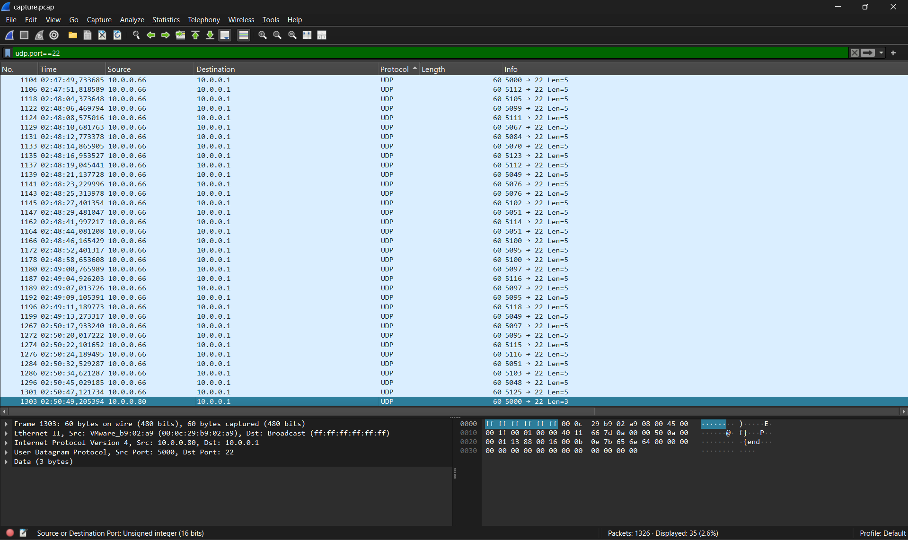

# shark on wire 2
[Link Challenge](https://play.picoctf.org/practice/challenge/84)

We found this [packet capture](https://jupiter.challenges.picoctf.org/static/b506393b6f9d53b94011df000c534759/capture.pcap). Recover the flag that was pilfered from the network.

#DigitalForensic #wu #pcap 
___
```
┌──(kali㉿oujisan)-[/mnt/c/Users/Ouji/Downloads/chall]
└─$ ls
capture.pcap
```

Analisa menggunakan wireshark

Awalnya setelah menoba mengikuti UDP Stream ditemukan salah satu potongan flag
```
icoCTF{StaT31355e
```

Saat mencari potongan lainnya tidak ketemu dan hanya menemukan dummy, dan spam message.

Dan pada titik ini , ditemukan terdapat string start dan end pada jaringan

Start
```
1104	02:47:49,733685	10.0.0.66	10.0.0.1	UDP	60	5000 → 22 Len=5
```

end
```
1303	02:50:49,205394	10.0.0.80	10.0.0.1	UDP	60	5000 → 22 Len=3
```

Dalam rentan ini berusaha untuk menemukan flag tetapi masih tidak ketemu. Sampai akhirnya kami mencoba filter display  port 22 karena kedua destinasi atau tujuan port adalah 22.

Akhirnya disini jika diurutkan berdasarkan Nomor, start berada pada paling atas dan end berada pada bagian paling bawah. Ketika di UDP String tidak ada hasil jadi kami coba untuk amati lagi.



Ternyata pada port sumber itu tidak konsisten, hanya port tujuan saja yang konsisten 22. Dari sini kami mencoba untuk menuliskan angka yang berbeda untuk mencari petunjuk. 

```
112 105 99 111 67 84 70 123 112 049 076 076 102 51 114 51 100 95 100 97 116 97 95 118 49 97 95 115 116 51 103 48 125
```

Kami mencoba menulis 3 digit terakhir dari port dan menyusunnya. Setelah itu mencari decode yang pas untuk pesan ini.

Saat mencoba ASCII decoders, disini flag berhasil ditemukan
```
picoCTF{p1LLf3r3d_data_v1a_st3g0}
```