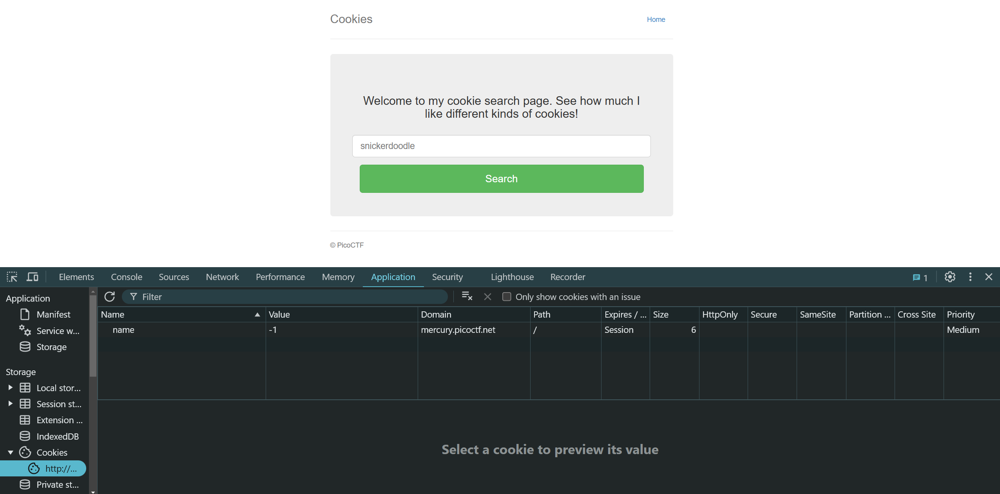
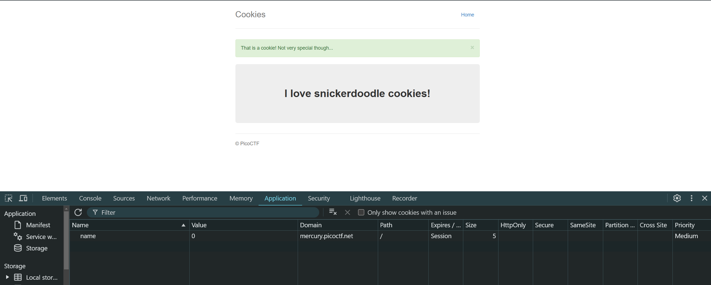
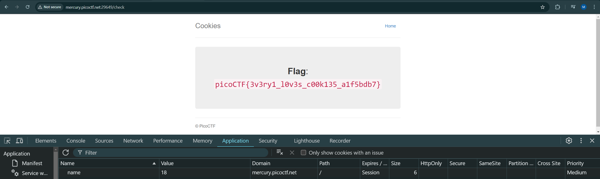

# Cookies
[Link Challenge](https://play.picoctf.org/practice/challenge/174)

Who doesn't love cookies? Try to figure out the best one.

#webexp #wu #cookies
___

Cookies menyimpan jejak dan aktivitas dari pengunjung.

Isi textbox sama dengan placeholder yang telah ada yaitu, `snickerdoodle` sambil melihat value dari name di cookies.




Disini value dari name berubah dari -1 menjadi 0.

Telusuri lebih lanjut dengan mengubah nilai dari name. Setelah dicoba paling jauh adalah 28, sehingga kita harus cek diantara 1 hingga 28.

Pada value 18 flag pun terlihat


```
picoCTF{3v3ry1_l0v3s_c00k135_a1f5bdb7}
```
