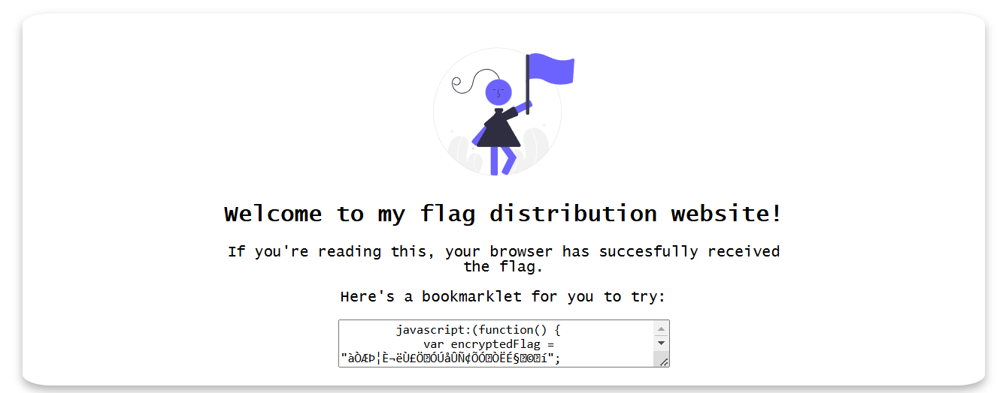
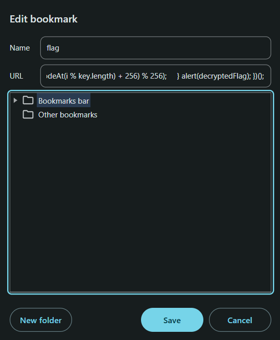
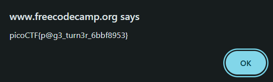

# Bookmarklet
[Link Challenge](https://play.picoctf.org/practice/challenge/406)

Why search for the flag when I can make a bookmarklet to print it for me?

#webexp #wu 
___



Didapatkan script javascript bookmarklet dibawah ini:
```js
javascript:(function() {
    var encryptedFlag = "àÒÆަȬë٣֖ÓÚåÛÑ¢ÕӜÒËɧœ©™í";
    var key = "picoctf";
    var decryptedFlag = "";
    for (var i = 0; i < encryptedFlag.length; i++) {
        decryptedFlag += String.fromCharCode((encryptedFlag.charCodeAt(i) - key.charCodeAt(i % key.length) + 256) % 256);
    }
alert(decryptedFlag);
})();
```

Setelah dicari pada google, cara menjalankan bookmarklet ini dengan cara membuat bookmark pada browser. 
*source:* https://www.freecodecamp.org/news/what-are-bookmarklets/



Save dan buka bookmark untuk mendapatkan flag



```
picoCTF{p@g3_turn3r_6bbf8953}
```