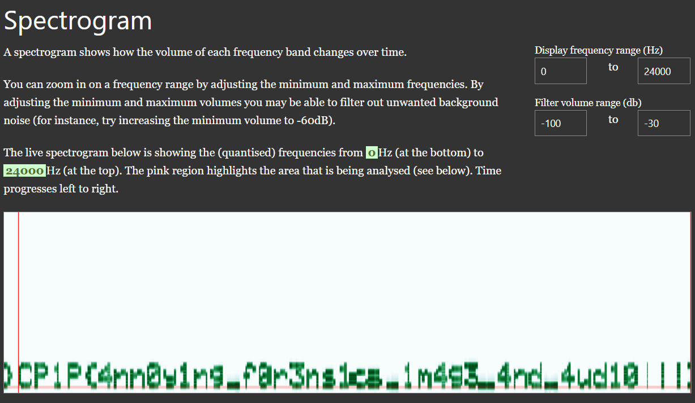

# Audio Image

Author: **Orch4th**

Welcome to the future of explorer, where an image can output audio and audio can also output images. However, the future also has problems, so we hope you can help

The future has a special image about the developer of the future world which has special audio in it, but someone managed to hack the image and change the audio into a hidden message. Help us to track and get special messages from these hackers.

attachment: [https://download1527.mediafire.com/jqxwns9a2pkg6jb1FlBbHIHmmV1sgMz4pHj2-uVYQsFQK5cdy8h8AkOa2WSyhgoRWgCeGZBtkTZhFTRqBmNjkhxoQbdytnxqehEBHrFRnCuz6ZfwdwwFqXERibUgi1bnodE0zlKxYnNRFSeuA7IV2PfhmuQMBmcYFAirX_pdYdIGew/ky9joaw8aji33qw/meme.png](https://download1527.mediafire.com/jqxwns9a2pkg6jb1FlBbHIHmmV1sgMz4pHj2-uVYQsFQK5cdy8h8AkOa2WSyhgoRWgCeGZBtkTZhFTRqBmNjkhxoQbdytnxqehEBHrFRnCuz6ZfwdwwFqXERibUgi1bnodE0zlKxYnNRFSeuA7IV2PfhmuQMBmcYFAirX_pdYdIGew/ky9joaw8aji33qw/meme.png)

#Forensic #wu #audio
___
```
┌──(kali㉿oujisan)-[/mnt/d/TCP1P365/forensic/AudioImages]
└─$ ls
meme.png 
```

Coba analisa menggunakan `binwalk`. Karena pada deskripsi terdapat audio, bisa aja disembunyikan dalam gambar.

```
┌──(kali㉿oujisan)-[/mnt/d/TCP1P365/forensic/AudioImages]
└─$ binwalk meme.png

DECIMAL       HEXADECIMAL     DESCRIPTION
--------------------------------------------------------------------------------
0             0x0             PNG image, 337 x 600, 8-bit/color RGBA, non-interlaced
62            0x3E            Zlib compressed data, default compression
161638        0x27766         RIFF audio data (WAV), PCM, 1 channels, 44100 sample rate
```

Ekstrak aja.
```
binwalk --dd=".*" meme.png
```

Terdapat file WAV audio yang ternyata seperti morse code yang sangat cepat.

Pakai [MorseCode.World](https://morsecode.world/international/decoder/audio-decoder-expert.html) untuk memudahkan membaca.



Ya, Begitulah
```
TCP1P{4nn0y1ng_f0r3ns1cs_1m4g3_4nd_4ud10!!!}
```
