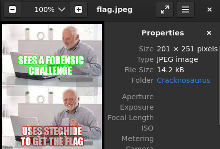

# Cracknosaurus

Author: Orch4th

Budi is a vocational school student and a famous hacker in his class and has the mindset that things that exist in the real world can actually also be created in the digital world. Therefore, Budi tried to make a digital dinosaur called Cracknosaurus in the hope that the digital dinosaur he made could rule the world like the ancient dinosaurs of ancient times.

Cracknosaurus may look like an ordinary file, but you wouldn't know what Budi is hiding in this really extraordinary cracknosaurus image.

Hints
Cracknosaurus actually have a digital friend, namely rockyousaurus, which when combined can solve everything.

#Forensic #WriteUp #john #rockyou 
___
```
┌──(kali㉿oujisan)-[/mnt/d/TCP1P365/forensic/Cracknosaurus]
└─$ ls
flag.zip
```

Diketahui jika file ini dienkripsi menggunakan AES Method.
```
┌──(kali㉿oujisan)-[/mnt/d/TCP1P365/forensic/Cracknosaurus]
└─$ file flag.zip
flag.zip: Zip archive data, at least v2.0 to extract, compression method=AES Encrypted
```

```
┌──(kali㉿oujisan)-[/mnt/d/TCP1P365/forensic/Cracknosaurus]
└─$ unzip -l flag.zip
Archive:  flag.zip
  Length      Date    Time    Name
---------  ---------- -----   ----
    14182  2024-03-21 16:56   flag.jpeg
---------                     -------
    14182                     1 file
```

Di dalamnya hanya terdapat `flag.jpeg`.

Pada hint soal juga sudah diberitahu jika kita harus menggunakan `rockyou` untuk melakukan brute force untuk menemukan password. Jadi pakai aja john.

Ekstrak hash.
```
┌──(kali㉿oujisan)-[/mnt/d/TCP1P365/forensic/Cracknosaurus]
└─$ zip2john flag.zip > key.hash
```

Lakukan Brute Force
```
┌──(kali㉿oujisan)-[/mnt/d/TCP1P365/forensic/Cracknosaurus]
└─$ john --wordlist=/usr/share/wordlists/rockyou.txt key.hash
Using default input encoding: UTF-8
Loaded 1 password hash (ZIP, WinZip [PBKDF2-SHA1 256/256 AVX2 8x])
Cost 1 (HMAC size) is 14035 for all loaded hashes
Will run 12 OpenMP threads
Press 'q' or Ctrl-C to abort, almost any other key for status
tcpip            (flag.zip/flag.jpeg)
1g 0:00:00:27 DONE (2025-02-15 08:15) 0.03653g/s 122116p/s 122116c/s 122116C/s tearcraft..taz1971
Use the "--show" option to display all of the cracked passwords reliably
Session completed.
```

Yap, kita menemukan password dari zip adalah `tcpip`.

Ekstrak pakai password yang ada.
```
┌──(kali㉿oujisan)-[/mnt/d/TCP1P365/forensic/Cracknosaurus]
└─$ unzip -P "tcpip" flag.zip
Archive:  flag.zip
   skipping: flag.jpeg               unsupported compression method 99
```

Karena tidak support, kita pakai `7z` aja.
```
┌──(kali㉿oujisan)-[/mnt/d/TCP1P365/forensic/Cracknosaurus]
└─$ 7z x flag.zip -ptcpip

7-Zip 24.08 (x64) : Copyright (c) 1999-2024 Igor Pavlov : 2024-08-11
 64-bit locale=en_US.UTF-8 Threads:12 OPEN_MAX:1024

Scanning the drive for archives:
1 file, 14253 bytes (14 KiB)

Extracting archive: flag.zip
--
Path = flag.zip
Type = zip
Physical Size = 14253

Everything is Ok

Size:       14182
Compressed: 14253
```

Ternyata tidak sesimpel itu mas bro.


Kita masih disuruh pake `steghide` untuk mendapatkan flag.
```
┌──(kali㉿oujisan)-[/mnt/d/TCP1P365/forensic/Cracknosaurus]
└─$ steghide extract -sf flag.jpeg
Enter passphrase:
steghide: could not extract any data with that passphrase!
```

Alamak, ada passwordnya lo rek. Disini aku coba buat bruteforce pakai `stegcracker` estimasi butuh 5 jam. Jadi, aku coba alternatif dengan memakai `stegseek`.
```
┌──(kali㉿oujisan)-[/mnt/d/TCP1P365/forensic/Cracknosaurus]
└─$ stegseek flag.jpeg
StegSeek 0.6 - https://github.com/RickdeJager/StegSeek

[i] Found passphrase: "190324")
[i] Original filename: "flag.txt".
[i] Extracting to "flag.jpeg.out".
```

Wow, cepat sekali :v

Yaudah cek aja itu hasil ekstrak nya.
```
┌──(kali㉿oujisan)-[/mnt/d/TCP1P365/forensic/Cracknosaurus]
└─$ file flag.jpeg.out
flag.jpeg.out: ASCII text
```

CAAATTTT
```
┌──(kali㉿oujisan)-[/mnt/d/TCP1P365/forensic/Cracknosaurus]
└─$ cat flag.jpeg.out
TCP1P{m4st3r1ng_cr4ck1ng_w1th_r0cky0u!!!}
```
