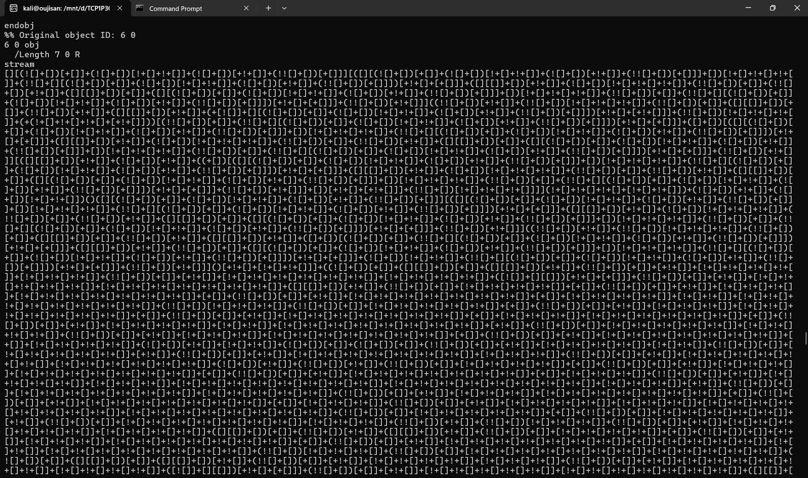
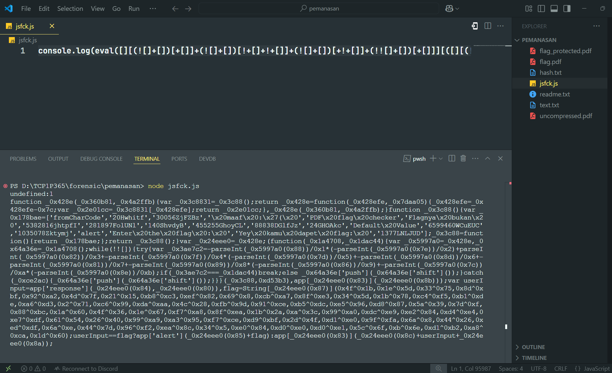
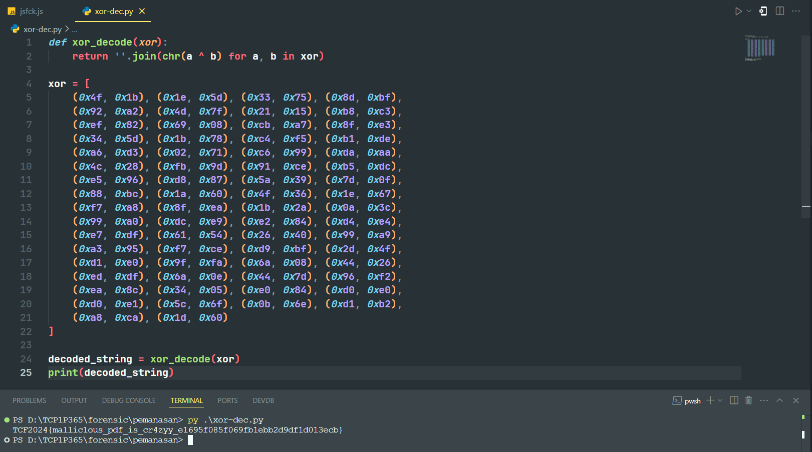

# Pemanasan

Author: **fire**
I just create handmade pdf. Well i also made flag checker inside pdf file. Cool right? 😎

#Forensic #wu #pdf #js-script #john #rockyou
___
```
┌──(kali㉿oujisan)-[/mnt/d/TCP1P365/forensic/pemanasan]
└─$ ls
flag_protected.pdf  readme.txt
```

Diberi sebuah file pdf dengan password untuk membukanya. Aku coba buat bruteforce pakai `john` dengan wordlist `rockyou.txt`.

Ekstrak dulu hashnya
```
pdf2john flag_protected.pdf > hash.txt
```

Lakukan brute force
```
┌──(kali㉿oujisan)-[/mnt/d/TCP1P365/forensic/pemanasan]
└─$ john --wordlist=/usr/share/wordlists/rockyou.txt hash.txt
Using default input encoding: UTF-8
Loaded 1 password hash (PDF [MD5 SHA2 RC4/AES 32/64])
Cost 1 (revision) is 3 for all loaded hashes
Will run 12 OpenMP threads
Press 'q' or Ctrl-C to abort, almost any other key for status
0g 0:00:00:07 15.92% (ETA: 08:00:38) 0g/s 355923p/s 355923c/s 355923C/s zhiyian123..zhiadalon
makanapel        (flag_protected.pdf)
1g 0:00:00:16 DONE (2025-02-14 08:00) 0.06250g/s 366576p/s 366576c/s 366576C/s makantahik..makako53071987
Use the "--show --format=PDF" options to display all of the cracked passwords reliably
Session completed.
```

Ditemukan bahwa password dari pdf tersebut adalah `makanapel`
```
┌──(kali㉿oujisan)-[/mnt/d/TCP1P365/forensic/pemanasan]
└─$ john --show hash.txt
flag_protected.pdf:makanapel

1 password hash cracked, 0 left
```

Gunakan `qpdf` untuk membuka pdf dan membuat file pdf baru tanpa password.
```
┌──(kali㉿oujisan)-[/mnt/d/TCP1P365/forensic/pemanasan]
└─$ qpdf --decrypt --password=makanapel flag_protected.pdf flag.pdf
```

Ternyata di dalamnya terdapat script JS yang merupakan flag checker. Sementara kita lewati dulu.


Isi dari PDF nya sebagai berikut:


Sempat sebelumnya di mention dugaan adanya script javascript dalam file. Ketika di check ternyata benar.
```
┌──(kali㉿oujisan)-[/mnt/d/TCP1P365/forensic/pemanasan]
└─$ strings flag.pdf | grep "JS"
<< /JS 6 0 R /S /JavaScript /Type /Action >>
```

Atau lebih detailnya
```
┌──(kali㉿oujisan)-[/mnt/d/TCP1P365/forensic/pemanasan]
└─$ strings flag.pdf | grep "/"
<< /OpenAction 3 0 R /Outlines 4 0 R /Pages 5 0 R /Type /Catalog >>
<< /ModDate (D:20231214080647Z) /Producer (iLovePDF) >>
<< /JS 6 0 R /S /JavaScript /Type /Action >>
<< /Count 0 /Type /Outlines >>
<< /Count 1 /Kids [ 7 0 R ] /Type /Pages >>
<< /Filter /FlateDecode /Length 2999 >>
? U/I>+
#YI/HMr
<< /Contents 8 0 R /MediaBox [ 0 0 612 792 ] /Parent 5 0 R /Resources << /Font << /F1 9 0 R >> /ProcSet [ /PDF /Text ] >> /Type /Page >>
<< /Filter /FlateDecode /Length 371 >>
<< /BaseFont /Helvetica /Encoding /MacRomanEncoding /Subtype /Type1 /Type /Font >>
trailer << /Info 2 0 R /Root 1 0 R /Size 10 /ID [<a645d7e408794a431860c44de885b3ef><3cfb1834d6c2ac0fc57c067d52d82474>] >>
```

Yang menarik perhatian adalah obj 6 karena memiliki panjang 2999 karakter. 
File ini di kompresi menggunakan algoritma `FlateDecode`

Selanjutnya kita akan melakukan dekompresi pada file `flag.pdf` menggunakan `qpdf`
```
qpdf --qdf flag.pdf uncompressed.pdf
```

Gunakan `strings` untuk melihat lagi script JS nya.
Pada Obj 6 Terdapat `JSFuck` yang panjang banget dah



Disini kita bisa membuat file `js` dengan syntax
```
console.log(eval(isi dari JSFuck))
```
atau menggunakan web untuk decode.



yang setelah dirapikan menjadi seperti ini
```js
function _0x428e(_0x360b81, _0x4a2ffb) {
    var _0x3c8831 = _0x3c88();
    return _0x428e = function(_0x428efe, _0x7daa05) {
        _0x428efe = _0x428efe - 0x7c;
        var _0x2e01cc = _0x3c8831[_0x428efe];
        return _0x2e01cc;
    }, _0x428e(_0x360b81, _0x4a2ffb);
}

function _0x3c88() {
    var _0x178bae = ['fromCharCode', '20Hwhitf', '30056ZjFZBz', '\x20maaf\x20:\x27(\x20', 'PDF\x20flag\x20checker', 'Flagnya\x20bukan\x20', '5382816jhtpfI', '281897FolUNl', '140ShvdyB', '455255GhoyCL', '88838DGlfJz', '24GHOAkc', 'Default\x20Value', '6599460WCuEUC', '1035078Zktymj', 'alert', 'Enter\x20the\x20flag\x20:\x20', 'Yey\x20kamu\x20dapet\x20flag:\x20', '1377LNLJUD'];
    _0x3c88 = function() {
        return _0x178bae;
    };
    return _0x3c88();
}
var _0x24eee0 = _0x428e;
(function(_0x1a4708, _0x1dac44) {
    var _0x5997a0 = _0x428e,
        _0x64a36e = _0x1a4708();
    while (!![]) {
        try {
            var _0x3ae7c2 = -parseInt(_0x5997a0(0x88)) / 0x1 * (-parseInt(_0x5997a0(0x7e)) / 0x2) + parseInt(_0x5997a0(0x82)) / 0x3 + -parseInt(_0x5997a0(0x7f)) / 0x4 * (-parseInt(_0x5997a0(0x7d)) / 0x5) + -parseInt(_0x5997a0(0x8d)) / 0x6 + -parseInt(_0x5997a0(0x81)) / 0x7 + -parseInt(_0x5997a0(0x89)) / 0x8 * (-parseInt(_0x5997a0(0x86)) / 0x9) + -parseInt(_0x5997a0(0x7c)) / 0xa * (-parseInt(_0x5997a0(0x8e)) / 0xb);
            if (_0x3ae7c2 === _0x1dac44) break;
            else _0x64a36e['push'](_0x64a36e['shift']());
        } catch (_0xce2ac) {
            _0x64a36e['push'](_0x64a36e['shift']());
        }
    }
}(_0x3c88, 0xd53b3), app[_0x24eee0(0x83)](_0x24eee0(0x8b)));
var userInput = app['response'](_0x24eee0(0x84), _0x24eee0(0x80)),
    flag = String[_0x24eee0(0x87)](0x4f ^ 0x1b, 0x1e ^ 0x5d, 0x33 ^ 0x75, 0x8d ^ 0xbf, 0x92 ^ 0xa2, 0x4d ^ 0x7f, 0x21 ^ 0x15, 0xb8 ^ 0xc3, 0xef ^ 0x82, 0x69 ^ 0x8, 0xcb ^ 0xa7, 0x8f ^ 0xe3, 0x34 ^ 0x5d, 0x1b ^ 0x78, 0xc4 ^ 0xf5, 0xb1 ^ 0xde, 0xa6 ^ 0xd3, 0x2 ^ 0x71, 0xc6 ^ 0x99, 0xda ^ 0xaa, 0x4c ^ 0x28, 0xfb ^ 0x9d, 0x91 ^ 0xce, 0xb5 ^ 0xdc, 0xe5 ^ 0x96, 0xd8 ^ 0x87, 0x5a ^ 0x39, 0x7d ^ 0xf, 0x88 ^ 0xbc, 0x1a ^ 0x60, 0x4f ^ 0x36, 0x1e ^ 0x67, 0xf7 ^ 0xa8, 0x8f ^ 0xea, 0x1b ^ 0x2a, 0xa ^ 0x3c, 0x99 ^ 0xa0, 0xdc ^ 0xe9, 0xe2 ^ 0x84, 0xd4 ^ 0xe4, 0xe7 ^ 0xdf, 0x61 ^ 0x54, 0x26 ^ 0x40, 0x99 ^ 0xa9, 0xa3 ^ 0x95, 0xf7 ^ 0xce, 0xd9 ^ 0xbf, 0x2d ^ 0x4f, 0xd1 ^ 0xe0, 0x9f ^ 0xfa, 0x6a ^ 0x8, 0x44 ^ 0x26, 0xed ^ 0xdf, 0x6a ^ 0xe, 0x44 ^ 0x7d, 0x96 ^ 0xf2, 0xea ^ 0x8c, 0x34 ^ 0x5, 0xe0 ^ 0x84, 0xd0 ^ 0xe0, 0xd0 ^ 0xe1, 0x5c ^ 0x6f, 0xb ^ 0x6e, 0xd1 ^ 0xb2, 0xa8 ^ 0xca, 0x1d ^ 0x60);
userInput == flag ? app['alert'](_0x24eee0(0x85) + flag) : app[_0x24eee0(0x83)](_0x24eee0(0x8c) + userInput + _0x24eee0(0x8a));
```

Kita fokus pada variabel `flag`. 
```js
flag = String[_0x24eee0(0x87)](0x4f ^ 0x1b, 0x1e ^ 0x5d, 0x33 ^ 0x75, 0x8d ^ 0xbf, 0x92 ^ 0xa2, 0x4d ^ 0x7f, 0x21 ^ 0x15, 0xb8 ^ 0xc3, 0xef ^ 0x82, 0x69 ^ 0x8, 0xcb ^ 0xa7, 0x8f ^ 0xe3, 0x34 ^ 0x5d, 0x1b ^ 0x78, 0xc4 ^ 0xf5, 0xb1 ^ 0xde, 0xa6 ^ 0xd3, 0x2 ^ 0x71, 0xc6 ^ 0x99, 0xda ^ 0xaa, 0x4c ^ 0x28, 0xfb ^ 0x9d, 0x91 ^ 0xce, 0xb5 ^ 0xdc, 0xe5 ^ 0x96, 0xd8 ^ 0x87, 0x5a ^ 0x39, 0x7d ^ 0xf, 0x88 ^ 0xbc, 0x1a ^ 0x60, 0x4f ^ 0x36, 0x1e ^ 0x67, 0xf7 ^ 0xa8, 0x8f ^ 0xea, 0x1b ^ 0x2a, 0xa ^ 0x3c, 0x99 ^ 0xa0, 0xdc ^ 0xe9, 0xe2 ^ 0x84, 0xd4 ^ 0xe4, 0xe7 ^ 0xdf, 0x61 ^ 0x54, 0x26 ^ 0x40, 0x99 ^ 0xa9, 0xa3 ^ 0x95, 0xf7 ^ 0xce, 0xd9 ^ 0xbf, 0x2d ^ 0x4f, 0xd1 ^ 0xe0, 0x9f ^ 0xfa, 0x6a ^ 0x8, 0x44 ^ 0x26, 0xed ^ 0xdf, 0x6a ^ 0xe, 0x44 ^ 0x7d, 0x96 ^ 0xf2, 0xea ^ 0x8c, 0x34 ^ 0x5, 0xe0 ^ 0x84, 0xd0 ^ 0xe0, 0xd0 ^ 0xe1, 0x5c ^ 0x6f, 0xb ^ 0x6e, 0xd1 ^ 0xb2, 0xa8 ^ 0xca, 0x1d ^ 0x60);
```

Ini merupakan XOR Encryptiion, jika dipython kita bisa decrypt menggunakan `''.join(chr(a ^ b) for a, b in pairs)` dimana `pairs` adalah isi dari XOR tersebut.



```
TCF2024{mallic1ous_pdf_is_cr4zyy_e1695f085f069fb1ebb2d9df1d013ecb}
```